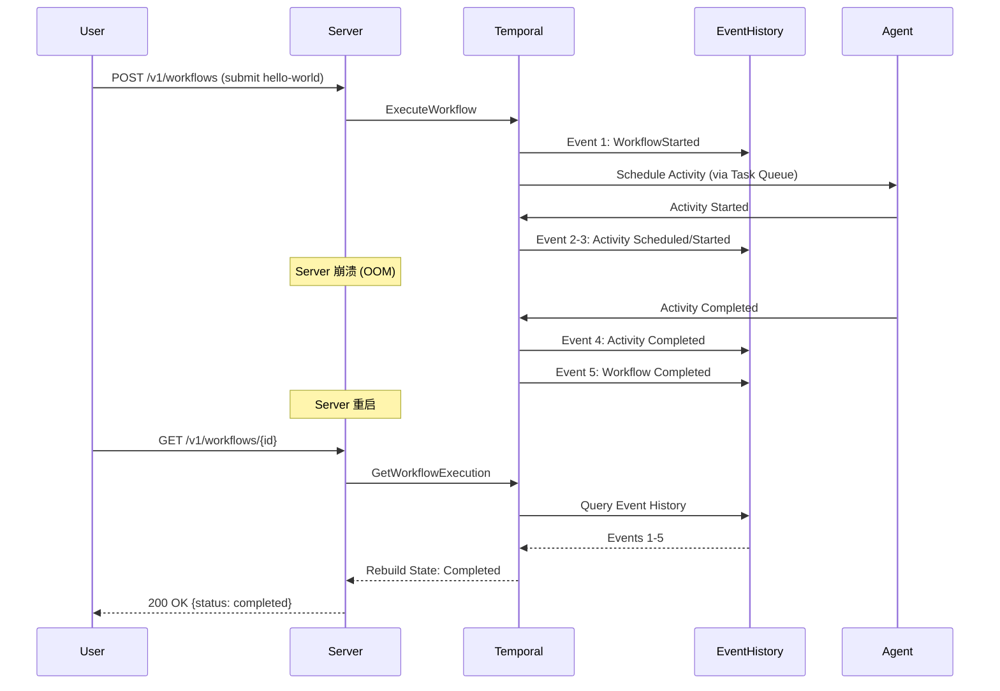
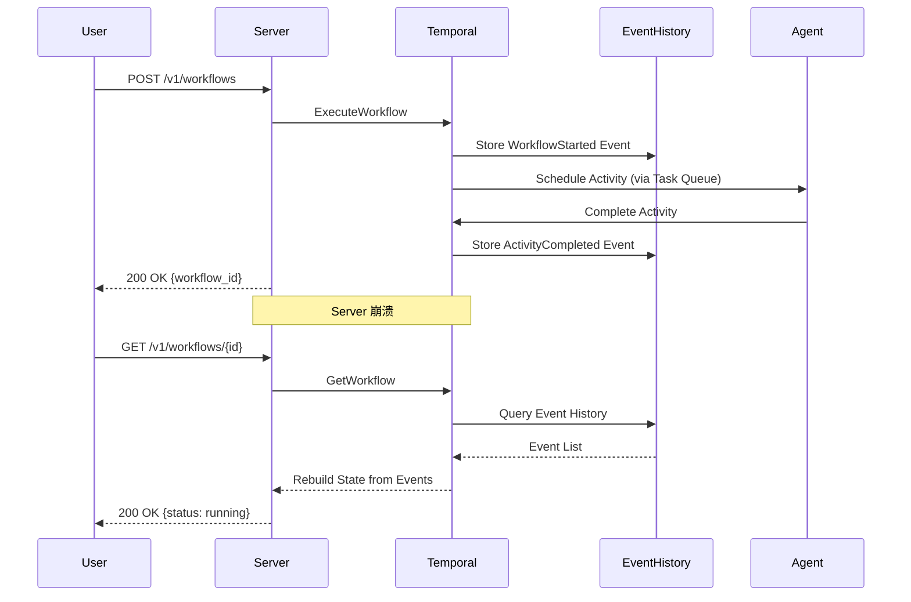
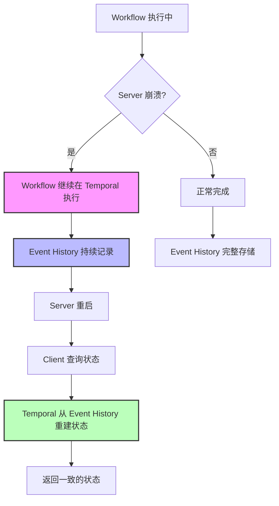

# Event Sourcing 执行模型

## 概述 (Overview)

Event Sourcing 是 Waterflow 工作流引擎的核心执行模型。通过 Temporal Event History 机制,Waterflow 实现了完整的状态持久化、崩溃恢复和时间旅行调试能力。本文档深入解析 Event Sourcing 的原理、优势和实际应用。

**目标用户:**
- 高级用户 - 理解系统可靠性保障
- 架构师 - 评估架构决策和权衡
- 开发者 - 调试工作流执行问题

**为什么需要 Event Sourcing:**
- 零状态丢失 - 所有执行历史完整存储
- 崩溃恢复 - Server/Agent 崩溃后自动恢复
- 时间旅行调试 - 查看任意时刻的执行状态
- 完整审计日志 - 工作流执行的每个细节可追溯

---

## 核心概念 (Core Concepts)

### Event Sourcing 定义

**Event Sourcing** 是一种将应用程序状态存储为一系列事件的架构模式,而非直接存储最新状态。Waterflow 基于 Temporal 的 Event History 机制实现了这一模式:

- **事件 (Event):** 每个工作流操作都会生成一个或多个事件 (如 `WorkflowStarted`, `ActivityScheduled`, `ActivityCompleted`)
- **Event History:** 所有事件按时间顺序存储在 Temporal 的持久化存储中
- **状态重建 (State Reconstruction):** 工作流状态可以通过重放 Event History 完整重建

### Temporal Event History 机制

Temporal 提供了生产级的 Event Sourcing 实现:

**Event History 存储:**
- 所有事件持久化到数据库 (PostgreSQL/MySQL/Cassandra)
- 事件不可变 (Immutable) - 一旦写入永不修改
- 事件有序 - 严格按照发生时间排序
- 事件完整 - 包含执行的所有上下文信息

**Event History 结构:**
```
Workflow Execution:
  └─ Event 1: WorkflowExecutionStarted
  └─ Event 2: ActivityTaskScheduled (Step 1)
  └─ Event 3: ActivityTaskStarted
  └─ Event 4: ActivityTaskCompleted
  └─ Event 5: ActivityTaskScheduled (Step 2)
  └─ Event 6: ActivityTaskStarted
  └─ Event 7: ActivityTaskFailed
  └─ Event 8: ActivityTaskScheduled (Step 2 Retry)
  └─ Event 9: ActivityTaskStarted
  └─ Event 10: ActivityTaskCompleted
  └─ Event 11: WorkflowExecutionCompleted
```

### Waterflow 如何使用 Event History

Waterflow 通过 Temporal SDK 与 Event History 交互:

**工作流执行时:**
1. Server 接收工作流请求 → 解析 YAML DSL
2. Server 调用 `temporal.ExecuteWorkflow()` → Temporal 写入 `WorkflowStarted` 事件
3. Workflow 调度 Activity → Temporal 写入 `ActivityScheduled` 事件
4. Agent 执行节点 → Temporal 写入 `ActivityStarted`, `ActivityCompleted` 事件
5. Workflow 完成 → Temporal 写入 `WorkflowCompleted` 事件

**状态查询时:**
1. Client 调用 `GET /v1/workflows/{id}/status`
2. Server 调用 `workflow.Describe()` → Temporal 读取 Event History
3. Temporal 重放事件并重建状态 → 返回当前状态 (Running/Completed/Failed)

**崩溃恢复时:**
1. Server 崩溃 → Workflow 继续在 Temporal 中执行
2. Server 重启 → 无需恢复状态 (状态存储在 Temporal)
3. Client 查询工作流 → Temporal 从 Event History 重建状态并返回

---

## 与传统状态存储对比

### Event Sourcing vs Database State

| 维度 | Event Sourcing (Waterflow) | 传统数据库状态存储 |
|------|----------------------------|-------------------|
| **状态存储** | 存储所有事件,通过重放事件重建状态 | 直接存储最新状态 |
| **审计日志** | ✅ 完整审计日志 - 所有操作可追溯 | ❌ 需要额外实现审计日志 |
| **时间旅行** | ✅ 可查看任意时刻的状态 | ❌ 只能查看当前状态 |
| **崩溃恢复** | ✅ 自动从 Event History 恢复 | ❌ 需要手动保存/恢复状态 |
| **并发控制** | ✅ Temporal 原生支持 | ⚠️ 需要手动实现锁机制 |
| **调试能力** | ✅ 重放事件精确复现问题 | ❌ 难以复现间歇性问题 |
| **存储体积** | ⚠️ Event History 会持续增长 | ✅ 只存储最新状态,体积小 |
| **查询性能** | ⚠️ 重建状态需要重放事件 | ✅ 直接查询最新状态 |
| **事件溯源** | ✅ 原生支持事件溯源 | ❌ 需要额外实现 |

### 优势分析

**1. 完整审计日志**
- 每个操作都有对应的事件记录
- 支持合规性审计 (SOC2/ISO27001/GDPR)
- 可追溯: 谁、在什么时间、做了什么操作

**示例:** 工作流失败后,可以精确查看哪个 Step 失败、失败原因、重试次数、最终结果。

**2. 时间旅行调试**
- 查看工作流在任意时刻的状态
- 重放事件复现问题现场
- Temporal UI 可视化 Event History

**示例:** 工作流昨天 14:32 失败,可以通过 Event History 查看失败前的所有操作,定位根本原因。

**3. 零状态丢失**
- Server 崩溃不影响工作流执行
- 重启后状态自动恢复
- 避免状态不一致问题

**示例:** Server 因 OOM 崩溃,重启后所有工作流继续执行,状态完全一致。

### 劣势分析

**1. Event History 体积增长**
- 长时间运行的工作流会产生大量事件
- Event History 不会自动删除 (需要手动配置保留策略)

**缓解方案:**
- Temporal 支持配置 Workflow Execution Retention (默认 7 天)
- 对于长期运行的工作流,可以使用 Continue-As-New 机制重置 Event History

**2. 查询复杂度**
- 查询工作流状态需要重放事件
- 高频查询可能影响 Temporal 性能

**缓解方案:**
- Waterflow Server 缓存工作流状态 (减少对 Temporal 的查询)
- 使用 Temporal Visibility API 查询工作流列表 (支持索引查询)

---

## 实际示例

### 示例 1: 完整的 Event History (JSON 格式)

以下是一个简单工作流的完整 Event History:

```json
{
  "events": [
    {
      "eventId": 1,
      "eventType": "WorkflowExecutionStarted",
      "timestamp": "2026-01-15T10:00:00Z",
      "workflowExecutionStartedEventAttributes": {
        "workflowType": {"name": "WaterflowExecutor"},
        "taskQueue": {"name": "linux-amd64"},
        "input": {"yaml_path": "examples/hello-world.yaml"}
      }
    },
    {
      "eventId": 2,
      "eventType": "WorkflowTaskScheduled",
      "timestamp": "2026-01-15T10:00:00Z"
    },
    {
      "eventId": 3,
      "eventType": "WorkflowTaskStarted",
      "timestamp": "2026-01-15T10:00:01Z",
      "workflowTaskStartedEventAttributes": {
        "scheduledEventId": 2,
        "identity": "waterflow-server@1.0.0"
      }
    },
    {
      "eventId": 4,
      "eventType": "WorkflowTaskCompleted",
      "timestamp": "2026-01-15T10:00:01Z"
    },
    {
      "eventId": 5,
      "eventType": "ActivityTaskScheduled",
      "timestamp": "2026-01-15T10:00:01Z",
      "activityTaskScheduledEventAttributes": {
        "activityId": "job-greet-step-1",
        "activityType": {"name": "ExecuteNode"},
        "taskQueue": {"name": "linux-amd64"},
        "input": {"node": "exec/shell", "command": "echo 'Hello World'"},
        "scheduleToCloseTimeout": "300s",
        "scheduleToStartTimeout": "60s",
        "startToCloseTimeout": "300s"
      }
    },
    {
      "eventId": 6,
      "eventType": "ActivityTaskStarted",
      "timestamp": "2026-01-15T10:00:02Z",
      "activityTaskStartedEventAttributes": {
        "scheduledEventId": 5,
        "identity": "waterflow-agent@linux-server-1"
      }
    },
    {
      "eventId": 7,
      "eventType": "ActivityTaskCompleted",
      "timestamp": "2026-01-15T10:00:03Z",
      "activityTaskCompletedEventAttributes": {
        "scheduledEventId": 5,
        "startedEventId": 6,
        "result": {"stdout": "Hello World", "exit_code": 0}
      }
    },
    {
      "eventId": 8,
      "eventType": "WorkflowTaskScheduled",
      "timestamp": "2026-01-15T10:00:03Z"
    },
    {
      "eventId": 9,
      "eventType": "WorkflowTaskStarted",
      "timestamp": "2026-01-15T10:00:03Z"
    },
    {
      "eventId": 10,
      "eventType": "WorkflowTaskCompleted",
      "timestamp": "2026-01-15T10:00:03Z"
    },
    {
      "eventId": 11,
      "eventType": "WorkflowExecutionCompleted",
      "timestamp": "2026-01-15T10:00:03Z",
      "workflowExecutionCompletedEventAttributes": {
        "result": {"status": "success", "jobs": [{"name": "greet", "status": "success"}]}
      }
    }
  ]
}
```

**关键观察:**
- 11 个事件记录了工作流的完整生命周期
- 每个事件都有时间戳、事件类型、详细属性
- 可以精确复现工作流执行过程

### 示例 2: 工作流崩溃后恢复

**场景:** Server 在工作流执行过程中崩溃,然后重启。



**关键点:**
1. **Server 崩溃不影响 Workflow 执行** - Workflow 继续在 Temporal 中运行
2. **Agent 正常完成 Activity** - Event History 持续记录
3. **Server 重启后状态一致** - 通过 Event History 重建状态

### 示例 3: 如何通过 Temporal UI 查看 Event History

**步骤 1:** 访问 Temporal UI (默认端口 8088)

```bash
# 启动 Waterflow Stack
docker-compose up -d

# 访问 Temporal UI
open http://localhost:8088
```

**步骤 2:** 搜索工作流执行

- 导航到 Workflows → Running/Completed/Failed
- 输入 Workflow ID 或使用过滤条件搜索

**步骤 3:** 查看 Event History

- 点击 Workflow Execution → History 标签页
- 查看所有事件的时间线
- 展开事件查看详细属性

**步骤 4:** 时间旅行调试

- 点击任意事件 → "Show Workflow at this point"
- Temporal 会重放事件到该时刻并显示状态
- 可以查看该时刻的变量值、执行栈等

---

## 架构图表

### Event Sourcing 数据流图



### Server 崩溃恢复流程图



### Event History 存储架构图

```
┌────────────────────────────────────────────────────────────┐
│ Temporal Service                                            │
│                                                             │
│  ┌─────────────────┐        ┌──────────────────────────┐   │
│  │ Workflow Service│───────→│ Persistence Service      │   │
│  │                 │        │ (Event History Storage)  │   │
│  └─────────────────┘        └──────────────────────────┘   │
│           │                            │                    │
│           │                            ↓                    │
│           │                   ┌─────────────────┐           │
│           │                   │ PostgreSQL DB   │           │
│           │                   │                 │           │
│           │                   │ - events        │           │
│           │                   │ - executions    │           │
│           │                   │ - history       │           │
│           │                   └─────────────────┘           │
│           ↓                                                 │
│  ┌─────────────────┐                                        │
│  │ Task Queue      │                                        │
│  │ (linux-amd64)   │                                        │
│  └─────────────────┘                                        │
└──────────────┬─────────────────────────────────────────────┘
               │
               ↓
       ┌──────────────┐
       │ Agent Worker │
       │ (linux-amd64)│
       └──────────────┘
```

---

## 交叉引用 (References)

### 架构设计文档
- [ADR-0001: 使用 Temporal 作为工作流引擎](../adr/0001-use-temporal-workflow-engine.md) - 为什么选择 Temporal 和 Event Sourcing
- [ADR-0002: 单节点执行模式](../adr/0002-single-node-execution-pattern.md) - Event History 中每个 Step 对应一个 Activity Event
- [Architecture Document](../architecture.md#event-sourcing-持久化) - 完整架构设计 (C4 Model)
- [Temporal 架构分析](../analysis/temporal-architecture-analysis.md) - Temporal Event Sourcing 深度分析

### 实现细节
- [Story 1.8: Temporal SDK 集成和工作流执行引擎](../sprint-artifacts/1-8-temporal-sdk-integration.md) - Event Sourcing 实现
- [Story 7.4: 压力测试和容错能力](../sprint-artifacts/7-4-stress-testing-fault-tolerance.md) - 崩溃恢复测试

### 用户指南
- [Troubleshooting Guide - 工作流调试](../troubleshooting.md#工作流调试) - 如何使用 Event History 调试
- [API Guide - 查询工作流状态](../api-guide.md#查询工作流状态) - GetWorkflow API 如何使用 Event History

---

**Last Updated:** 2026-01-15  
**Document Version:** 1.0  
**Author:** Waterflow Team
