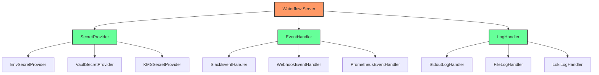
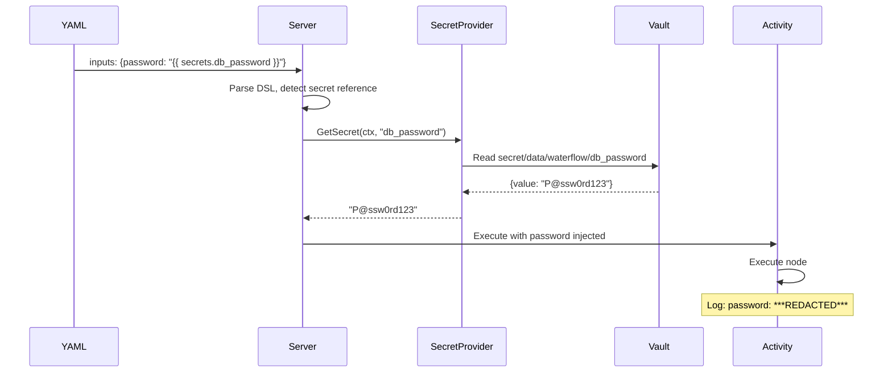
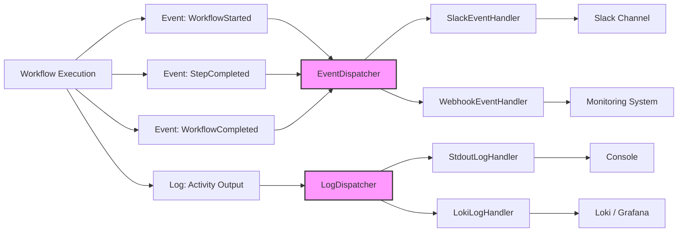

# 集成接口设计

## 概述 (Overview)

Waterflow 采用接口驱动的可扩展性设计，提供了 4 个核心集成接口，允许用户集成外部系统（CMDB、密钥管理、监控系统、日志系统）而无需修改核心代码。这些接口是企业级部署的关键，使 Waterflow 能够无缝融入现有的 DevOps 工具链。

**目标用户:**
- 企业集成开发者 - 集成现有的企业系统（CMDB、Vault、监控）
- DevOps 工程师 - 配置和管理集成接口
- 架构师 - 评估集成能力和扩展方案

**为什么需要集成接口:**
- 企业系统集成 - 连接 CMDB、Ansible Inventory、HashiCorp Vault 等
- 零凭证存储 - 密钥运行时注入，不存储在 YAML 或数据库中
- 可观测性集成 - 将事件和日志发送到 Prometheus、Loki、Slack 等
- 灵活扩展 - 自定义集成实现，满足特定业务需求

---

## 核心概念 (Core Concepts)

### Waterflow 的可扩展性设计理念

Waterflow 的可扩展性设计遵循 **依赖倒置原则 (Dependency Inversion Principle)**:

**设计原则:**
- **核心依赖接口，而非具体实现** - Server 依赖 `SecretProvider` 接口，而非具体的 `VaultSecretProvider`
- **默认实现开箱即用** - 提供简单的默认实现（如 `EnvSecretProvider`）
- **自定义实现替换默认** - 用户可以实现接口并通过配置注入
- **编译时类型安全** - 接口在编译时检查，避免运行时错误

**架构层次:**

```
┌──────────────────────────────────────────────────────┐
│ Waterflow Core (Server/Agent)                       │
│   ├─ Depends on Interfaces (不依赖具体实现)         │
│   │   ├─ SecretProvider                             │
│   │   ├─ EventHandler                               │
│   │   ├─ LogHandler                                 │
│   │   └─ ServerGroupProvider (已取消)               │
│   └─ Default Implementations (开箱即用)             │
│       ├─ EnvSecretProvider                          │
│       ├─ WebhookEventHandler                        │
│       └─ StdoutLogHandler                           │
└──────────────────────────────────────────────────────┘
                        ↑
                        │ (用户实现并注入)
                        ↓
┌──────────────────────────────────────────────────────┐
│ Custom Implementations (企业集成)                    │
│   ├─ VaultSecretProvider (HashiCorp Vault)          │
│   ├─ SlackEventHandler (Slack 通知)                 │
│   ├─ LokiLogHandler (Loki 日志)                     │
│   └─ PrometheusEventHandler (Prometheus Pushgateway)│
└──────────────────────────────────────────────────────┘
```

### 4 个集成接口的职责和使用场景

| 接口 | 职责 | 默认实现 | 使用场景 |
|------|------|---------|---------|
| **SecretProvider** | 运行时密钥注入 | EnvSecretProvider | HashiCorp Vault, AWS KMS, 环境变量 |
| **EventHandler** | 工作流生命周期事件 | WebhookEventHandler | Slack 通知, Prometheus, 自定义告警 |
| **LogHandler** | 工作流执行日志 | StdoutLogHandler, FileLogHandler | Loki, CloudWatch Logs, Elasticsearch |
| **ServerGroupProvider** | 服务器组信息查询 | (已取消) | (已由 Task Queue 直接映射替代) |

---

## 接口 1: SecretProvider

### 职责: 运行时密钥注入, 零凭证存储

**SecretProvider** 负责在工作流执行时动态注入密钥，实现零凭证存储原则:

**核心原则:**
- **零存储** - 密钥不存储在 YAML 文件或数据库中
- **运行时注入** - 在 Activity 执行时动态获取密钥
- **自动脱敏** - 日志中的密钥自动脱敏显示

**工作流程:**

```
1. YAML 定义密钥引用:
   inputs:
     password: "{{ secrets.db_password }}"

2. Server 解析 DSL 时识别密钥引用

3. Activity 执行时调用 SecretProvider:
   secretProvider.GetSecret(ctx, "db_password")

4. SecretProvider 从外部系统获取密钥:
   - EnvSecretProvider → 从环境变量获取
   - VaultSecretProvider → 从 HashiCorp Vault 获取
   - KMSSecretProvider → 从 AWS KMS 获取

5. 密钥注入到 Activity 输入，执行节点

6. 日志记录时自动脱敏:
   "password": "***REDACTED***"
```

### 接口方法: `GetSecret(ctx, key) (value, error)`

**接口定义:**

```go
package secrets

import "context"

// SecretProvider 定义密钥提供者接口
type SecretProvider interface {
    // GetSecret 获取密钥值
    // ctx: 上下文,用于超时控制
    // key: 密钥键名 (如 "db_password")
    // 返回: 密钥值和错误
    GetSecret(ctx context.Context, key string) (string, error)
    
    // ListSecrets 列出所有可用密钥 (可选方法)
    ListSecrets(ctx context.Context) ([]string, error)
}
```

**方法说明:**

- **GetSecret(ctx, key):**
  - 参数: `key` - 密钥键名 (如 `db_password`, `api_token`)
  - 返回: 密钥值 (明文字符串) 或错误
  - 超时: 使用 `ctx` 控制超时 (默认 5 秒)
  - 错误处理: 密钥不存在、超时、网络错误等

- **ListSecrets(ctx):** (可选)
  - 返回所有可用密钥的键名列表
  - 用于 CLI 命令 `waterflow-cli secrets list`

### 默认实现: EnvSecretProvider

**EnvSecretProvider** 从环境变量获取密钥:

```go
package secrets

import (
    "context"
    "fmt"
    "os"
)

// EnvSecretProvider 从环境变量获取密钥
type EnvSecretProvider struct {
    Prefix string  // 环境变量前缀 (如 "WATERFLOW_SECRET_")
}

func (p *EnvSecretProvider) GetSecret(ctx context.Context, key string) (string, error) {
    // 构造环境变量名: WATERFLOW_SECRET_<KEY>
    envKey := fmt.Sprintf("%s%s", p.Prefix, key)
    
    value := os.Getenv(envKey)
    if value == "" {
        return "", fmt.Errorf("secret %s not found in environment", key)
    }
    
    return value, nil
}

func (p *EnvSecretProvider) ListSecrets(ctx context.Context) ([]string, error) {
    // 遍历所有环境变量,找到以 Prefix 开头的
    var secrets []string
    for _, env := range os.Environ() {
        if strings.HasPrefix(env, p.Prefix) {
            key := strings.TrimPrefix(env, p.Prefix)
            key = strings.Split(key, "=")[0]
            secrets = append(secrets, key)
        }
    }
    return secrets, nil
}
```

**使用示例:**

```bash
# 设置环境变量
export WATERFLOW_SECRET_db_password="P@ssw0rd123"
export WATERFLOW_SECRET_api_token="token-abc-xyz"

# 在 YAML 中引用密钥
```

```yaml
jobs:
  - name: backup-database
    runs-on: linux-amd64
    steps:
      - name: Backup MySQL
        node: exec/shell
        inputs:
          command: mysqldump -u root -p{{ secrets.db_password }} wordpress > backup.sql
```

### 使用场景: HashiCorp Vault 集成, AWS KMS 集成, 环境变量注入

**场景 1: HashiCorp Vault 集成**

```go
package secrets

import (
    "context"
    "fmt"
    
    vault "github.com/hashicorp/vault/api"
)

// VaultSecretProvider 从 HashiCorp Vault 获取密钥
type VaultSecretProvider struct {
    Client *vault.Client
    Path   string  // Vault 路径 (如 "secret/data/waterflow")
}

func (p *VaultSecretProvider) GetSecret(ctx context.Context, key string) (string, error) {
    // 从 Vault 读取密钥
    secretPath := fmt.Sprintf("%s/%s", p.Path, key)
    secret, err := p.Client.Logical().ReadWithContext(ctx, secretPath)
    if err != nil {
        return "", fmt.Errorf("failed to read secret from vault: %w", err)
    }
    
    if secret == nil || secret.Data == nil {
        return "", fmt.Errorf("secret %s not found in vault", key)
    }
    
    // Vault KV v2 的数据结构
    data := secret.Data["data"].(map[string]interface{})
    value, ok := data["value"].(string)
    if !ok {
        return "", fmt.Errorf("secret %s has invalid format", key)
    }
    
    return value, nil
}
```

**Server 配置:**

```yaml
# /etc/waterflow/server.yaml
secrets:
  provider: vault
  vault:
    address: https://vault.example.com:8200
    token: ${VAULT_TOKEN}  # 从环境变量获取
    path: secret/data/waterflow
```

**场景 2: AWS KMS 集成**

```go
package secrets

import (
    "context"
    "encoding/base64"
    
    "github.com/aws/aws-sdk-go/aws"
    "github.com/aws/aws-sdk-go/service/kms"
)

// KMSSecretProvider 从 AWS KMS 获取密钥
type KMSSecretProvider struct {
    Client *kms.KMS
    KeyID  string  // KMS Key ID
}

func (p *KMSSecretProvider) GetSecret(ctx context.Context, key string) (string, error) {
    // 从 KMS 解密密钥
    input := &kms.DecryptInput{
        CiphertextBlob: []byte(key),  // 假设 key 是加密后的密文
        KeyId:          aws.String(p.KeyID),
    }
    
    result, err := p.Client.DecryptWithContext(ctx, input)
    if err != nil {
        return "", fmt.Errorf("failed to decrypt secret with KMS: %w", err)
    }
    
    return string(result.Plaintext), nil
}
```

---

## 接口 2: EventHandler

### 职责: 接收工作流生命周期事件

**EventHandler** 接收工作流的生命周期事件，用于通知、监控、告警等:

**事件类型:**
- `WorkflowStarted` - 工作流开始执行
- `WorkflowCompleted` - 工作流成功完成
- `WorkflowFailed` - 工作流执行失败
- `WorkflowCancelled` - 工作流被取消
- `JobStarted` - Job 开始执行
- `JobCompleted` - Job 完成执行
- `StepStarted` - Step 开始执行
- `StepCompleted` - Step 完成执行

### 接口方法: `OnWorkflowStart`, `OnWorkflowComplete`, `OnWorkflowFailed`

**接口定义:**

```go
package events

import (
    "context"
    "time"
)

// EventHandler 定义事件处理器接口
type EventHandler interface {
    // OnWorkflowStart 工作流开始事件
    OnWorkflowStart(ctx context.Context, event WorkflowStartEvent) error
    
    // OnWorkflowComplete 工作流完成事件
    OnWorkflowComplete(ctx context.Context, event WorkflowCompleteEvent) error
    
    // OnWorkflowFailed 工作流失败事件
    OnWorkflowFailed(ctx context.Context, event WorkflowFailedEvent) error
    
    // OnWorkflowCancelled 工作流取消事件
    OnWorkflowCancelled(ctx context.Context, event WorkflowCancelledEvent) error
}

// WorkflowStartEvent 工作流开始事件
type WorkflowStartEvent struct {
    WorkflowID   string    `json:"workflow_id"`
    WorkflowName string    `json:"workflow_name"`
    StartTime    time.Time `json:"start_time"`
    Initiator    string    `json:"initiator"`  // 谁提交的工作流
}

// WorkflowCompleteEvent 工作流完成事件
type WorkflowCompleteEvent struct {
    WorkflowID   string        `json:"workflow_id"`
    WorkflowName string        `json:"workflow_name"`
    StartTime    time.Time     `json:"start_time"`
    EndTime      time.Time     `json:"end_time"`
    Duration     time.Duration `json:"duration"`
    Status       string        `json:"status"`  // "success"
}

// WorkflowFailedEvent 工作流失败事件
type WorkflowFailedEvent struct {
    WorkflowID   string        `json:"workflow_id"`
    WorkflowName string        `json:"workflow_name"`
    StartTime    time.Time     `json:"start_time"`
    EndTime      time.Time     `json:"end_time"`
    Duration     time.Duration `json:"duration"`
    Error        string        `json:"error"`
    FailedStep   string        `json:"failed_step"`
}
```

### 默认实现: WebhookEventHandler, NoOpEventHandler

**WebhookEventHandler** 通过 HTTP Webhook 发送事件:

```go
package events

import (
    "bytes"
    "context"
    "encoding/json"
    "net/http"
)

// WebhookEventHandler 通过 HTTP Webhook 发送事件
type WebhookEventHandler struct {
    URL    string
    Client *http.Client
}

func (h *WebhookEventHandler) OnWorkflowComplete(ctx context.Context, event WorkflowCompleteEvent) error {
    payload := map[string]interface{}{
        "event_type": "workflow.completed",
        "workflow_id": event.WorkflowID,
        "workflow_name": event.WorkflowName,
        "duration": event.Duration.Seconds(),
        "status": "success",
    }
    
    jsonData, _ := json.Marshal(payload)
    req, _ := http.NewRequestWithContext(ctx, "POST", h.URL, bytes.NewBuffer(jsonData))
    req.Header.Set("Content-Type", "application/json")
    
    resp, err := h.Client.Do(req)
    if err != nil {
        return err
    }
    defer resp.Body.Close()
    
    return nil
}
```

**NoOpEventHandler** 空实现（不处理事件）:

```go
package events

// NoOpEventHandler 空实现，不处理任何事件
type NoOpEventHandler struct{}

func (h *NoOpEventHandler) OnWorkflowStart(ctx context.Context, event WorkflowStartEvent) error {
    return nil
}

func (h *NoOpEventHandler) OnWorkflowComplete(ctx context.Context, event WorkflowCompleteEvent) error {
    return nil
}

func (h *NoOpEventHandler) OnWorkflowFailed(ctx context.Context, event WorkflowFailedEvent) error {
    return nil
}
```

### 使用场景: Slack 通知, Prometheus Pushgateway, 自定义告警

**场景 1: Slack 通知**

```go
package events

import (
    "context"
    "fmt"
    
    "github.com/slack-go/slack"
)

// SlackEventHandler 发送事件到 Slack
type SlackEventHandler struct {
    Client  *slack.Client
    Channel string
}

func (h *SlackEventHandler) OnWorkflowComplete(ctx context.Context, event WorkflowCompleteEvent) error {
    message := fmt.Sprintf(
        "✅ Workflow *%s* completed successfully\n"+
        "Workflow ID: `%s`\n"+
        "Duration: %.2f seconds",
        event.WorkflowName,
        event.WorkflowID,
        event.Duration.Seconds(),
    )
    
    _, _, err := h.Client.PostMessage(
        h.Channel,
        slack.MsgOptionText(message, false),
    )
    return err
}

func (h *SlackEventHandler) OnWorkflowFailed(ctx context.Context, event WorkflowFailedEvent) error {
    message := fmt.Sprintf(
        "❌ Workflow *%s* failed\n"+
        "Workflow ID: `%s`\n"+
        "Failed Step: `%s`\n"+
        "Error: %s",
        event.WorkflowName,
        event.WorkflowID,
        event.FailedStep,
        event.Error,
    )
    
    _, _, err := h.Client.PostMessage(
        h.Channel,
        slack.MsgOptionText(message, false),
    )
    return err
}
```

**Server 配置:**

```yaml
# /etc/waterflow/server.yaml
events:
  handlers:
    - type: slack
      slack:
        token: ${SLACK_BOT_TOKEN}
        channel: "#waterflow-notifications"
```

**场景 2: Prometheus Pushgateway**

```go
package events

import (
    "context"
    
    "github.com/prometheus/client_golang/prometheus"
    "github.com/prometheus/client_golang/prometheus/push"
)

// PrometheusEventHandler 发送指标到 Prometheus Pushgateway
type PrometheusEventHandler struct {
    PushgatewayURL string
    
    workflowTotal    *prometheus.CounterVec
    workflowDuration *prometheus.HistogramVec
}

func (h *PrometheusEventHandler) OnWorkflowComplete(ctx context.Context, event WorkflowCompleteEvent) error {
    // 增加成功计数器
    h.workflowTotal.WithLabelValues(event.WorkflowName, "success").Inc()
    
    // 记录执行时间
    h.workflowDuration.WithLabelValues(event.WorkflowName).Observe(event.Duration.Seconds())
    
    // 推送到 Pushgateway
    return push.New(h.PushgatewayURL, "waterflow").
        Collector(h.workflowTotal).
        Collector(h.workflowDuration).
        Push()
}
```

---

## 接口 3: LogHandler

### 职责: 接收工作流执行日志

**LogHandler** 接收工作流执行过程中的所有日志，用于集中式日志管理:

**日志类型:**
- **Activity 日志** - 节点执行的 stdout/stderr
- **Workflow 日志** - Workflow 执行的进度日志
- **系统日志** - Server/Agent 的系统日志

### 接口方法: `OnLog(ctx, entry LogEntry)`

**接口定义:**

```go
package logs

import (
    "context"
    "time"
)

// LogHandler 定义日志处理器接口
type LogHandler interface {
    // OnLog 处理单条日志
    OnLog(ctx context.Context, entry LogEntry) error
    
    // Flush 刷新缓冲区 (批量写入时使用)
    Flush(ctx context.Context) error
}

// LogEntry 日志条目
type LogEntry struct {
    WorkflowID string    `json:"workflow_id"`
    JobName    string    `json:"job_name"`
    StepName   string    `json:"step_name"`
    Level      string    `json:"level"`      // info, warn, error
    Message    string    `json:"message"`
    Timestamp  time.Time `json:"timestamp"`
    Source     string    `json:"source"`     // activity, workflow, system
}
```

### 默认实现: StdoutLogHandler, FileLogHandler

**StdoutLogHandler** 输出到标准输出:

```go
package logs

import (
    "context"
    "fmt"
)

// StdoutLogHandler 输出日志到标准输出
type StdoutLogHandler struct{}

func (h *StdoutLogHandler) OnLog(ctx context.Context, entry LogEntry) error {
    fmt.Printf("[%s] [%s] [%s/%s] %s\n",
        entry.Timestamp.Format("2006-01-02 15:04:05"),
        entry.Level,
        entry.JobName,
        entry.StepName,
        entry.Message,
    )
    return nil
}

func (h *StdoutLogHandler) Flush(ctx context.Context) error {
    return nil
}
```

**FileLogHandler** 写入到文件:

```go
package logs

import (
    "context"
    "encoding/json"
    "os"
)

// FileLogHandler 写入日志到文件
type FileLogHandler struct {
    File *os.File
}

func (h *FileLogHandler) OnLog(ctx context.Context, entry LogEntry) error {
    jsonData, _ := json.Marshal(entry)
    jsonData = append(jsonData, '\n')
    
    _, err := h.File.Write(jsonData)
    return err
}

func (h *FileLogHandler) Flush(ctx context.Context) error {
    return h.File.Sync()
}
```

### 使用场景: Loki 集成, CloudWatch Logs, Elasticsearch

**场景 1: Loki 集成**

```go
package logs

import (
    "context"
    "fmt"
    
    "github.com/grafana/loki-client-go/loki"
)

// LokiLogHandler 发送日志到 Grafana Loki
type LokiLogHandler struct {
    Client *loki.Client
}

func (h *LokiLogHandler) OnLog(ctx context.Context, entry LogEntry) error {
    labels := map[string]string{
        "workflow_id": entry.WorkflowID,
        "job":         entry.JobName,
        "step":        entry.StepName,
        "level":       entry.Level,
        "source":      entry.Source,
    }
    
    return h.Client.Handle(labels, entry.Timestamp, entry.Message)
}

func (h *LokiLogHandler) Flush(ctx context.Context) error {
    return h.Client.Stop()
}
```

**Server 配置:**

```yaml
# /etc/waterflow/server.yaml
logs:
  handlers:
    - type: loki
      loki:
        url: http://loki.example.com:3100
        tenant_id: waterflow
```

---

## 实际示例

### 示例 1: SecretProvider 自定义实现 (CMDB 集成)

暂无ServerGroupProvider接口（已被Task Queue直接映射替代），此示例展示SecretProvider:

```go
package secrets

import (
    "context"
    "encoding/json"
    "fmt"
    "net/http"
)

// CMDBSecretProvider 从 CMDB 系统获取密钥
type CMDBSecretProvider struct {
    BaseURL string
    APIKey  string
    Client  *http.Client
}

func (p *CMDBSecretProvider) GetSecret(ctx context.Context, key string) (string, error) {
    // 构造 CMDB API 请求
    url := fmt.Sprintf("%s/api/secrets/%s", p.BaseURL, key)
    req, _ := http.NewRequestWithContext(ctx, "GET", url, nil)
    req.Header.Set("Authorization", "Bearer "+p.APIKey)
    
    resp, err := p.Client.Do(req)
    if err != nil {
        return "", fmt.Errorf("failed to query CMDB: %w", err)
    }
    defer resp.Body.Close()
    
    var result struct {
        Value string `json:"value"`
    }
    
    if err := json.NewDecoder(resp.Body).Decode(&result); err != nil {
        return "", fmt.Errorf("failed to decode CMDB response: %w", err)
    }
    
    return result.Value, nil
}
```

### 示例 2-4: EventHandler 和 LogHandler 自定义实现

见上文的 SlackEventHandler, PrometheusEventHandler, LokiLogHandler 示例。

### Server 配置注入接口

**完整的 Server 配置示例:**

```yaml
# /etc/waterflow/server.yaml
server:
  port: 8080
  tls:
    enabled: true
    cert: /etc/waterflow/tls/server.crt
    key: /etc/waterflow/tls/server.key

temporal:
  server: temporal.example.com:7233
  namespace: production

# SecretProvider 配置
secrets:
  provider: vault  # vault / env / kms
  vault:
    address: https://vault.example.com:8200
    token: ${VAULT_TOKEN}
    path: secret/data/waterflow

# EventHandler 配置
events:
  handlers:
    - type: slack
      slack:
        token: ${SLACK_BOT_TOKEN}
        channel: "#waterflow-notifications"
    - type: webhook
      webhook:
        url: https://monitoring.example.com/webhooks/waterflow

# LogHandler 配置
logs:
  handlers:
    - type: loki
      loki:
        url: http://loki.example.com:3100
        tenant_id: waterflow
    - type: file
      file:
        path: /var/log/waterflow/workflows.log
```

**Server 初始化代码:**

```go
package main

import (
    "github.com/websoft9/waterflow/pkg/secrets"
    "github.com/websoft9/waterflow/pkg/events"
    "github.com/websoft9/waterflow/pkg/logs"
)

func initServer(config Config) (*Server, error) {
    // 初始化 SecretProvider
    var secretProvider secrets.SecretProvider
    switch config.Secrets.Provider {
    case "vault":
        secretProvider = secrets.NewVaultProvider(config.Secrets.Vault)
    case "env":
        secretProvider = secrets.NewEnvProvider("WATERFLOW_SECRET_")
    default:
        secretProvider = secrets.NewEnvProvider("WATERFLOW_SECRET_")
    }
    
    // 初始化 EventHandlers
    var eventHandlers []events.EventHandler
    for _, handlerConfig := range config.Events.Handlers {
        switch handlerConfig.Type {
        case "slack":
            eventHandlers = append(eventHandlers, events.NewSlackHandler(handlerConfig.Slack))
        case "webhook":
            eventHandlers = append(eventHandlers, events.NewWebhookHandler(handlerConfig.Webhook))
        }
    }
    
    // 初始化 LogHandlers
    var logHandlers []logs.LogHandler
    for _, handlerConfig := range config.Logs.Handlers {
        switch handlerConfig.Type {
        case "loki":
            logHandlers = append(logHandlers, logs.NewLokiHandler(handlerConfig.Loki))
        case "file":
            logHandlers = append(logHandlers, logs.NewFileHandler(handlerConfig.File))
        }
    }
    
    // 创建 Server
    return &Server{
        SecretProvider: secretProvider,
        EventHandlers:  eventHandlers,
        LogHandlers:    logHandlers,
    }, nil
}
```

---

## 架构图表

### 4 个接口在架构中的位置图



### SecretProvider 运行时注入流程图



### EventHandler/LogHandler 事件流图



---

## 交叉引用 (References)

### 架构设计文档
- [ADR-0001: 使用 Temporal 作为工作流引擎](../adr/0001-use-temporal-workflow-engine.md) - Temporal 如何与集成接口协同工作
- [ADR-0007: Waterflow Server 作为单一入口](../adr/0007-waterflow-server-single-entry.md) - Server 如何管理和注入集成接口

### 实现细节
- [Story 9.2: SecretProvider 接口](../sprint-artifacts/9-2-secretprovider-interface.md) - SecretProvider 实现
- [Story 7.6: EventHandler 接口](../sprint-artifacts/7-6-eventhandler-interface.md) - EventHandler 实现
- [Story 7.7: LogHandler 接口](../sprint-artifacts/7-7-loghandler-interface.md) - LogHandler 实现
- [Story 2.3: ServerGroupProvider 接口](../sprint-artifacts/2-3-servergroupprovider-interface.md) - 已取消，使用 Task Queue 直接映射

### 用户指南
- [密钥管理指南](../guides/secrets-management.md) - SecretProvider 配置和使用
- [集成指南](../guides/integration-guide.md) - 集成接口开发指南
- [配置管理](../configuration.md) - Server 配置文件详解

### 相关概念
- [Task Queue 路由机制](./task-queue-routing.md) - 替代 ServerGroupProvider 的方案

---

**Last Updated:** 2026-01-15  
**Document Version:** 1.0  
**Author:** Waterflow Team
