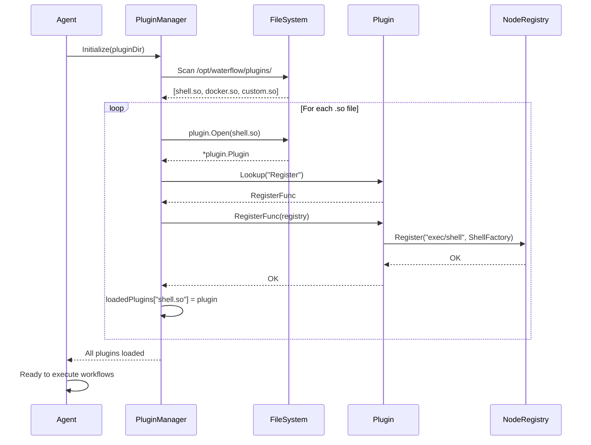
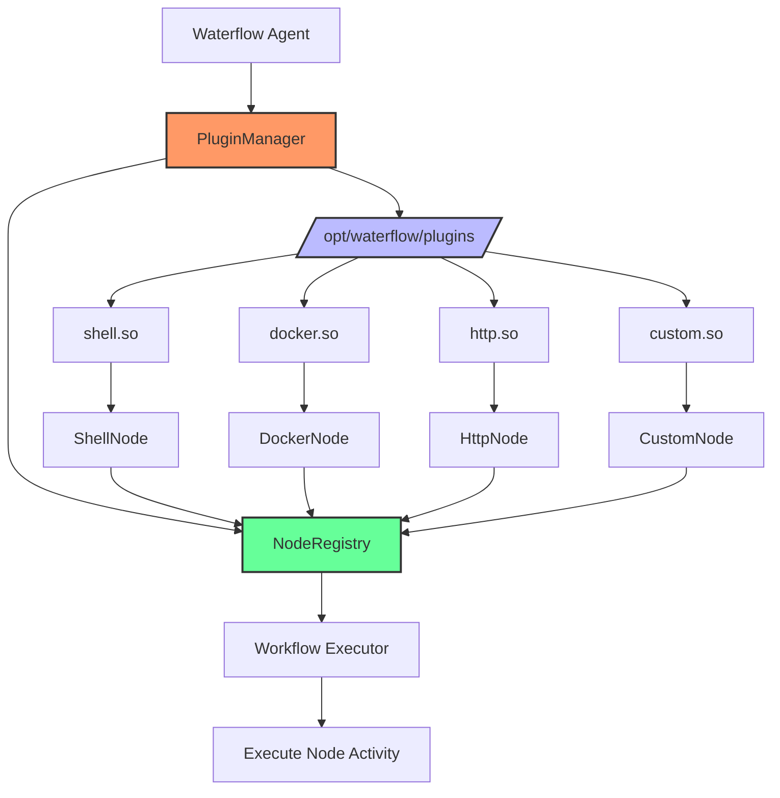
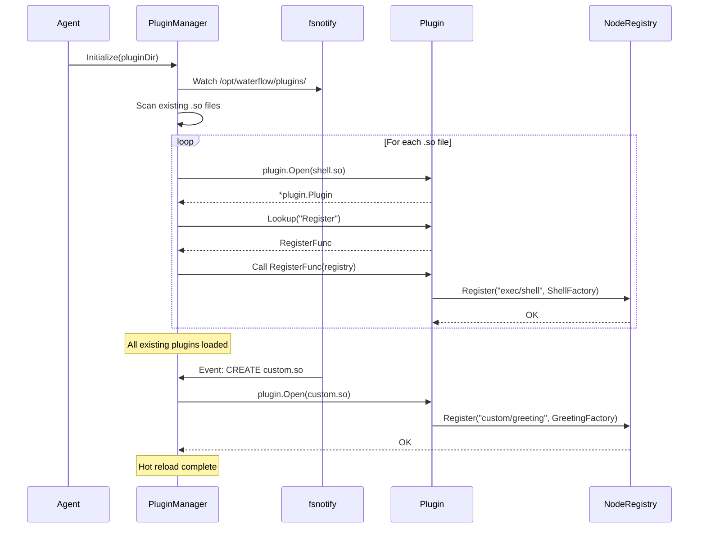
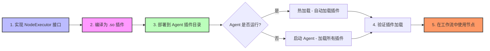

# 插件化节点系统

## 概述 (Overview)

Waterflow 采用插件化架构设计,允许节点 (Node) 作为独立的 Go Plugin (.so 动态库) 加载和执行。这种设计提供了极高的扩展性,用户可以开发自定义节点而无需修改核心代码或重新编译 Agent。

**目标用户:**
- 节点开发者 - 开发自定义节点扩展 Waterflow 功能
- 扩展性需求用户 - 理解如何集成自定义业务逻辑
- 架构师 - 评估插件系统的设计和限制

**为什么需要插件化节点系统:**
- 零核心代码修改 - 自定义节点无需修改 Waterflow 核心代码
- 热加载支持 - 新插件可以在运行时动态加载
- 语言一致性 - 插件使用 Go 开发,与核心代码一致
- 简化部署 - 插件以 .so 文件形式分发,部署简单

---

## 核心概念 (Core Concepts)

### Go Plugin 机制介绍

**Go Plugin** 是 Go 1.8+ 引入的官方插件系统,允许在运行时动态加载 Go 代码:

**核心特性:**
- **动态库 (.so):** 插件编译为共享库 (Shared Object)
- **运行时加载:** 使用 `plugin.Open()` 加载 .so 文件
- **符号查找:** 使用 `plugin.Lookup()` 查找导出的函数/变量
- **类型断言:** 将符号转换为具体的函数/接口类型

**Go Plugin 示例:**

插件代码 (`hello.go`):
```go
package main

import "fmt"

// 导出的函数 (必须首字母大写)
func SayHello(name string) string {
    return fmt.Sprintf("Hello, %s!", name)
}
```

编译插件:
```bash
go build -buildmode=plugin -o hello.so hello.go
```

加载插件:
```go
package main

import (
    "fmt"
    "plugin"
)

func main() {
    // 加载插件
    p, err := plugin.Open("hello.so")
    if err != nil {
        panic(err)
    }
    
    // 查找符号
    symbol, err := p.Lookup("SayHello")
    if err != nil {
        panic(err)
    }
    
    // 类型断言
    sayHello := symbol.(func(string) string)
    
    // 调用插件函数
    result := sayHello("World")
    fmt.Println(result)  // Output: Hello, World!
}
```

### 为什么选择插件系统

Waterflow 在以下方案中选择了 Go Plugin:

| 方案 | 优势 | 劣势 | Waterflow 评估 |
|------|------|------|---------------|
| **Go Plugin** | 语言一致性、简单部署、运行时加载 | 跨平台限制 (Linux/macOS) | ✅ **采用** |
| **内置编译** | 跨平台支持、无运行时开销 | 需要重新编译 Agent | ❌ 扩展性差 |
| **RPC 进程** | 跨语言支持、隔离性好 | 性能开销大、部署复杂 | ❌ 过度设计 |
| **脚本语言 (Lua/JS)** | 动态执行、跨平台 | 性能差、类型安全差 | ❌ 不适合 Go 项目 |

**Waterflow 选择 Go Plugin 的原因:**
1. **语言一致性:** 插件和核心代码都是 Go,类型安全、编译检查
2. **简化部署:** 插件以 .so 文件形式分发,无需重新编译 Agent
3. **运行时加载:** 支持热加载,新插件可以在运行时动态添加
4. **性能:** 原生 Go 代码,无额外性能开销

**限制和缓解方案:**
- **跨平台限制:** Go Plugin 仅支持 Linux/macOS,Windows 使用内置编译方案
- **Go 版本限制:** 插件和主程序必须使用相同的 Go 版本和编译选项
- **CGO 依赖:** Go Plugin 需要启用 CGO (`CGO_ENABLED=1`)

---

## 架构设计

### Plugin Manager 职责和工作流程

**PluginManager** 是 Waterflow Agent 的核心组件,负责插件的加载、注册和管理:

**职责:**
1. **扫描插件目录** - 查找所有 .so 文件
2. **加载插件** - 使用 `plugin.Open()` 加载 .so 文件
3. **调用注册函数** - 调用插件的 `Register()` 函数
4. **热加载** - 监控插件目录变化,自动加载新插件
5. **错误处理** - 处理加载失败、符号缺失等错误

**工作流程:**

```go
type PluginManager struct {
    registry      *NodeRegistry
    pluginDir     string
    loadedPlugins map[string]*plugin.Plugin
    watcher       *fsnotify.Watcher
}

func (pm *PluginManager) LoadPlugins() error {
    // 1. 扫描插件目录
    files, err := os.ReadDir(pm.pluginDir)
    if err != nil {
        return fmt.Errorf("failed to read plugin directory: %w", err)
    }
    
    // 2. 遍历 .so 文件
    for _, file := range files {
        if !strings.HasSuffix(file.Name(), ".so") {
            continue
        }
        
        pluginPath := filepath.Join(pm.pluginDir, file.Name())
        
        // 3. 加载插件
        p, err := plugin.Open(pluginPath)
        if err != nil {
            log.Errorf("Failed to load plugin %s: %v", pluginPath, err)
            continue
        }
        
        // 4. 查找 Register 函数
        symbol, err := p.Lookup("Register")
        if err != nil {
            log.Errorf("Plugin %s does not export Register function: %v", pluginPath, err)
            continue
        }
        
        // 5. 类型断言并调用 Register
        registerFunc, ok := symbol.(func(*NodeRegistry) error)
        if !ok {
            log.Errorf("Plugin %s: Register function has wrong signature", pluginPath)
            continue
        }
        
        // 6. 调用插件的 Register 函数
        if err := registerFunc(pm.registry); err != nil {
            log.Errorf("Plugin %s: Register failed: %v", pluginPath, err)
            continue
        }
        
        // 7. 记录已加载的插件
        pm.loadedPlugins[pluginPath] = p
        log.Infof("Successfully loaded plugin: %s", pluginPath)
    }
    
    return nil
}
```

### NodeRegistry 节点注册中心

**NodeRegistry** 是 Waterflow 的节点注册中心,存储所有可用节点的类型和工厂函数:

**数据结构:**

```go
type NodeRegistry struct {
    mu        sync.RWMutex
    factories map[string]NodeFactory  // 节点类型 → 工厂函数
}

type NodeFactory func() NodeExecutor

type NodeExecutor interface {
    Execute(ctx context.Context, inputs map[string]interface{}) (*NodeOutput, error)
    Validate(inputs map[string]interface{}) error
}
```

**核心方法:**

```go
// 注册节点
func (r *NodeRegistry) Register(nodeType string, factory NodeFactory) error {
    r.mu.Lock()
    defer r.mu.Unlock()
    
    if _, exists := r.factories[nodeType]; exists {
        return fmt.Errorf("node type %s already registered", nodeType)
    }
    
    r.factories[nodeType] = factory
    return nil
}

// 创建节点实例
func (r *NodeRegistry) Create(nodeType string) (NodeExecutor, error) {
    r.mu.RLock()
    defer r.mu.RUnlock()
    
    factory, exists := r.factories[nodeType]
    if !exists {
        return nil, fmt.Errorf("unknown node type: %s", nodeType)
    }
    
    return factory(), nil
}

// 列出所有注册的节点
func (r *NodeRegistry) ListNodes() []string {
    r.mu.RLock()
    defer r.mu.RUnlock()
    
    var nodes []string
    for nodeType := range r.factories {
        nodes = append(nodes, nodeType)
    }
    return nodes
}
```

### 节点接口定义 (NodeExecutor interface)

**NodeExecutor** 是 Waterflow 所有节点必须实现的接口:

```go
package sdk

import "context"

// NodeExecutor 定义节点执行接口
type NodeExecutor interface {
    // Execute 执行节点逻辑
    // ctx: 上下文,用于超时控制和取消
    // inputs: 节点输入参数 (来自 YAML DSL)
    // 返回: 节点输出和错误
    Execute(ctx context.Context, inputs map[string]interface{}) (*NodeOutput, error)
    
    // Validate 验证节点输入参数
    // inputs: 待验证的输入参数
    // 返回: 验证错误 (nil 表示通过)
    Validate(inputs map[string]interface{}) error
}

// NodeOutput 定义节点输出
type NodeOutput struct {
    Status    string                 `json:"status"`     // success/failure
    Result    map[string]interface{} `json:"result"`     // 节点执行结果
    Outputs   map[string]interface{} `json:"outputs"`    // 供其他 Step 引用的输出变量
    ErrorMsg  string                 `json:"error_msg"`  // 错误信息 (如果失败)
}
```

**接口设计原则:**
- **简单:** 只有 2 个方法,易于实现
- **上下文传递:** 通过 `context.Context` 支持超时和取消
- **灵活输入:** `inputs` 使用 `map[string]interface{}` 支持任意参数
- **结构化输出:** `NodeOutput` 包含状态、结果、输出变量

### 插件加载流程

完整的插件加载流程:



**关键步骤:**
1. Agent 启动时初始化 PluginManager
2. PluginManager 扫描插件目录
3. 对每个 .so 文件:
   - 使用 `plugin.Open()` 加载
   - 查找 `Register` 函数符号
   - 调用 `Register(registry)` 注册节点
4. 所有插件加载完成后,Agent 准备就绪

---

## 热加载机制

### fsnotify 监控插件目录变化

Waterflow 使用 [fsnotify](https://github.com/fsnotify/fsnotify) 库监控插件目录的文件变化:

```go
import "github.com/fsnotify/fsnotify"

func (pm *PluginManager) WatchPluginDirectory() error {
    watcher, err := fsnotify.NewWatcher()
    if err != nil {
        return fmt.Errorf("failed to create watcher: %w", err)
    }
    pm.watcher = watcher
    
    // 监控插件目录
    if err := watcher.Add(pm.pluginDir); err != nil {
        return fmt.Errorf("failed to watch plugin directory: %w", err)
    }
    
    // 启动监控 goroutine
    go pm.watchLoop()
    
    return nil
}

func (pm *PluginManager) watchLoop() {
    for {
        select {
        case event := <-pm.watcher.Events:
            if event.Op&fsnotify.Create == fsnotify.Create {
                // 新文件创建
                if strings.HasSuffix(event.Name, ".so") {
                    log.Infof("New plugin detected: %s", event.Name)
                    pm.loadPlugin(event.Name)
                }
            }
        case err := <-pm.watcher.Errors:
            log.Errorf("Watcher error: %v", err)
        }
    }
}
```

### 新插件自动加载流程

**场景:** 用户开发了新的自定义节点 `custom.so`,并复制到插件目录

```
1. 用户复制插件:
   $ cp custom.so /opt/waterflow/plugins/

2. fsnotify 检测到文件创建事件:
   Event: CREATE /opt/waterflow/plugins/custom.so

3. PluginManager 自动加载插件:
   - plugin.Open(/opt/waterflow/plugins/custom.so)
   - Lookup("Register")
   - Call Register(registry)

4. 新节点注册成功:
   - NodeRegistry 新增 "custom/greeting" 节点
   - Agent 日志: "Successfully loaded plugin: custom.so"

5. 立即可用:
   - 下一个提交的工作流可以使用 "custom/greeting" 节点
```

### 热加载的限制和注意事项

**限制:**

1. **无法卸载插件:** Go Plugin 不支持卸载已加载的插件
   - 一旦加载,插件会一直驻留在内存中
   - 无法热更新已加载的插件 (需要重启 Agent)

2. **Go 版本依赖:** 插件和主程序必须使用相同的 Go 版本
   - 不同 Go 版本编译的插件无法加载
   - 建议在 CI/CD 中统一 Go 版本

3. **符号冲突:** 多个插件不能导出同名的符号
   - 如果两个插件都导出 `Register`,会导致符号冲突
   - 建议使用包名前缀避免冲突

**注意事项:**

1. **插件开发时测试:** 在开发插件时,应该在独立环境中测试
2. **版本兼容性:** 插件应该明确标注兼容的 Waterflow 版本
3. **错误处理:** 插件加载失败不应导致 Agent 崩溃
4. **日志记录:** 插件加载/注册失败应该有清晰的错误日志

---

## 节点开发指南

### 自定义节点开发步骤

**步骤 1: 实现 NodeExecutor 接口**

创建 `greeting/greeting.go`:

```go
package main

import (
    "context"
    "fmt"
    
    "github.com/websoft9/waterflow/pkg/sdk"
)

// GreetingNode 自定义节点示例
type GreetingNode struct{}

func (n *GreetingNode) Execute(ctx context.Context, inputs map[string]interface{}) (*sdk.NodeOutput, error) {
    // 解析输入参数
    name, ok := inputs["name"].(string)
    if !ok {
        return nil, fmt.Errorf("input 'name' is required and must be string")
    }
    
    style, _ := inputs["style"].(string)
    if style == "" {
        style = "formal"
    }
    
    // 执行业务逻辑
    var greeting string
    switch style {
    case "formal":
        greeting = fmt.Sprintf("Hello, %s!", name)
    case "casual":
        greeting = fmt.Sprintf("Hey %s!", name)
    case "excited":
        greeting = fmt.Sprintf("OMG! Hi %s!!!", name)
    default:
        greeting = fmt.Sprintf("Hi, %s.", name)
    }
    
    // 返回输出
    return &sdk.NodeOutput{
        Status: "success",
        Result: map[string]interface{}{
            "message": greeting,
        },
        Outputs: map[string]interface{}{
            "greeting": greeting,  // 可被其他 Step 引用
        },
    }, nil
}

func (n *GreetingNode) Validate(inputs map[string]interface{}) error {
    // 验证必需参数
    if _, ok := inputs["name"]; !ok {
        return fmt.Errorf("input 'name' is required")
    }
    
    // 验证可选参数
    if style, ok := inputs["style"]; ok {
        styleStr, ok := style.(string)
        if !ok {
            return fmt.Errorf("input 'style' must be string")
        }
        validStyles := []string{"formal", "casual", "excited"}
        if !contains(validStyles, styleStr) {
            return fmt.Errorf("input 'style' must be one of: %v", validStyles)
        }
    }
    
    return nil
}

func contains(slice []string, item string) bool {
    for _, s := range slice {
        if s == item {
            return true
        }
    }
    return false
}

// Register 注册节点到 NodeRegistry (Go Plugin 要求导出)
func Register(registry *sdk.NodeRegistry) error {
    return registry.Register("custom/greeting", func() sdk.NodeExecutor {
        return &GreetingNode{}
    })
}
```

**步骤 2: 编译为 .so 插件**

```bash
# 确保 CGO 已启用
export CGO_ENABLED=1

# 编译插件
go build -buildmode=plugin -o greeting.so greeting.go

# 检查插件大小
ls -lh greeting.so
# -rw-r--r--  1 user  staff   5.2M Jan 15 10:00 greeting.so
```

**步骤 3: 部署插件到 Agent**

```bash
# 复制插件到 Agent 插件目录
sudo cp greeting.so /opt/waterflow/plugins/

# 如果 Agent 已启动,插件会自动加载 (热加载)
# 如果 Agent 未启动,启动 Agent 会自动加载所有插件
sudo systemctl start waterflow-agent
```

**步骤 4: 验证插件加载**

```bash
# 查看 Agent 日志
sudo journalctl -u waterflow-agent -f

# 预期输出:
# Jan 15 10:00:00 localhost waterflow-agent[1234]: Successfully loaded plugin: greeting.so
# Jan 15 10:00:00 localhost waterflow-agent[1234]: Registered node type: custom/greeting
```

**步骤 5: 在工作流中使用自定义节点**

创建 `greeting-workflow.yaml`:

```yaml
name: greeting-example
jobs:
  - name: greet-users
    runs-on: linux-amd64
    steps:
      - name: Formal Greeting
        node: custom/greeting
        inputs:
          name: Alice
          style: formal
        outputs:
          formal_greeting: "{{ outputs.greeting }}"
      
      - name: Casual Greeting
        node: custom/greeting
        inputs:
          name: Bob
          style: casual
        outputs:
          casual_greeting: "{{ outputs.greeting }}"
      
      - name: Print Greetings
        node: exec/shell
        inputs:
          command: |
            echo "Formal: {{ steps.formal_greeting.outputs.formal_greeting }}"
            echo "Casual: {{ steps.casual_greeting.outputs.casual_greeting }}"
```

提交工作流:

```bash
waterflow-cli submit greeting-workflow.yaml
```

### 节点开发模板

完整的节点开发模板 (包含错误处理、日志、测试):

```go
package main

import (
    "context"
    "fmt"
    
    "github.com/websoft9/waterflow/pkg/errors"
    "github.com/websoft9/waterflow/pkg/logger"
    "github.com/websoft9/waterflow/pkg/sdk"
)

type MyNode struct {
    logger *logger.Logger
}

func (n *MyNode) Execute(ctx context.Context, inputs map[string]interface{}) (*sdk.NodeOutput, error) {
    n.logger.Info("Executing MyNode", "inputs", inputs)
    
    // TODO: 实现节点逻辑
    
    result := map[string]interface{}{
        // TODO: 填充结果
    }
    
    return &sdk.NodeOutput{
        Status:  "success",
        Result:  result,
        Outputs: result,
    }, nil
}

func (n *MyNode) Validate(inputs map[string]interface{}) error {
    // TODO: 验证输入参数
    
    return nil
}

func Register(registry *sdk.NodeRegistry) error {
    return registry.Register("category/mynode", func() sdk.NodeExecutor {
        return &MyNode{
            logger: logger.New("mynode"),
        }
    })
}
```

### 节点测试和调试方法

**单元测试:**

创建 `greeting_test.go`:

```go
package main

import (
    "context"
    "testing"
    
    "github.com/stretchr/testify/assert"
    "github.com/stretchr/testify/require"
    "github.com/websoft9/waterflow/pkg/sdk"
)

func TestGreetingNode_Execute(t *testing.T) {
    node := &GreetingNode{}
    ctx := context.Background()
    
    tests := []struct {
        name    string
        inputs  map[string]interface{}
        want    string
        wantErr bool
    }{
        {
            name:   "formal greeting",
            inputs: map[string]interface{}{"name": "Alice", "style": "formal"},
            want:   "Hello, Alice!",
        },
        {
            name:   "casual greeting",
            inputs: map[string]interface{}{"name": "Bob", "style": "casual"},
            want:   "Hey Bob!",
        },
        {
            name:    "missing name",
            inputs:  map[string]interface{}{"style": "formal"},
            wantErr: true,
        },
    }
    
    for _, tt := range tests {
        t.Run(tt.name, func(t *testing.T) {
            output, err := node.Execute(ctx, tt.inputs)
            if tt.wantErr {
                require.Error(t, err)
                return
            }
            
            require.NoError(t, err)
            assert.Equal(t, "success", output.Status)
            assert.Equal(t, tt.want, output.Result["message"])
        })
    }
}

func TestGreetingNode_Validate(t *testing.T) {
    node := &GreetingNode{}
    
    // 有效输入
    err := node.Validate(map[string]interface{}{
        "name":  "Alice",
        "style": "formal",
    })
    assert.NoError(t, err)
    
    // 无效输入: 缺少 name
    err = node.Validate(map[string]interface{}{
        "style": "formal",
    })
    assert.Error(t, err)
    
    // 无效输入: style 不在允许列表
    err = node.Validate(map[string]interface{}{
        "name":  "Alice",
        "style": "invalid",
    })
    assert.Error(t, err)
}
```

运行测试:

```bash
go test -v ./...
```

**集成测试:**

创建测试工作流 `test-greeting.yaml`:

```yaml
name: test-greeting
jobs:
  - name: test
    runs-on: linux-amd64
    steps:
      - name: Test Greeting Node
        node: custom/greeting
        inputs:
          name: TestUser
          style: formal
```

提交并验证:

```bash
# 提交测试工作流
waterflow-cli submit test-greeting.yaml

# 查看执行日志
waterflow-cli logs <workflow_id>

# 验证输出包含 "Hello, TestUser!"
```

---

## 跨平台支持

### Linux/macOS 支持 Go Plugin

**支持的平台:**
- ✅ Linux (amd64, arm64)
- ✅ macOS (amd64, arm64)
- ❌ Windows (Go Plugin 不支持)

**编译要求:**
- Go 1.8+ (推荐 Go 1.21+)
- CGO 已启用 (`CGO_ENABLED=1`)
- 插件和主程序使用相同的 Go 版本和编译选项

**Linux 编译示例:**

```bash
export CGO_ENABLED=1
export GOOS=linux
export GOARCH=amd64
go build -buildmode=plugin -o mynode.so mynode.go
```

**macOS 编译示例:**

```bash
export CGO_ENABLED=1
export GOOS=darwin
export GOARCH=arm64  # M1/M2 Mac
go build -buildmode=plugin -o mynode.so mynode.go
```

### Windows fallback 方案 (内置编译)

由于 Windows 不支持 Go Plugin,Waterflow 在 Windows 上使用 **内置编译** 方案:

**内置编译 (Built-in Compilation):**
- 所有核心节点 (exec, docker, http, file) 直接编译到 Agent 二进制中
- 自定义节点需要提交 PR 到 Waterflow 仓库,合并后重新编译 Agent

**Windows 上的节点注册:**

```go
package main

import (
    "github.com/websoft9/waterflow/internal/agent/registry"
    "github.com/websoft9/waterflow/plugins/exec"
    "github.com/websoft9/waterflow/plugins/docker"
    "github.com/websoft9/waterflow/plugins/http"
    "github.com/websoft9/waterflow/plugins/file"
    // 自定义节点直接 import
    "github.com/websoft9/waterflow/plugins/custom"
)

func initRegistry() *registry.NodeRegistry {
    reg := registry.New()
    
    // 内置注册核心节点
    exec.Register(reg)
    docker.Register(reg)
    http.Register(reg)
    file.Register(reg)
    
    // 内置注册自定义节点
    custom.Register(reg)
    
    return reg
}
```

**Windows 用户使用自定义节点的流程:**
1. 开发自定义节点代码
2. 提交 PR 到 Waterflow GitHub 仓库
3. PR 合并后,等待新版本 Agent 发布
4. 下载新版本 Agent (包含自定义节点)

### Go 版本和 CGO 依赖说明

**Go 版本要求:**
- **最低版本:** Go 1.8 (Go Plugin 引入版本)
- **推荐版本:** Go 1.21+ (稳定性和性能优化)
- **版本一致性:** 插件和主程序必须使用 **完全相同** 的 Go 版本

**检查 Go 版本:**

```bash
# 检查主程序 Go 版本
waterflow-agent --version
# Waterflow Agent 1.0.0, built with go1.21.5

# 检查编译器 Go 版本
go version
# go version go1.21.5 linux/amd64

# 确保版本一致
```

**CGO 依赖:**

Go Plugin 依赖 CGO,必须启用 CGO 才能编译和加载插件:

```bash
# 检查 CGO 是否启用
go env CGO_ENABLED
# 1 (已启用)

# 如果未启用,设置环境变量
export CGO_ENABLED=1

# 编译插件
go build -buildmode=plugin -o mynode.so mynode.go
```

**CGO 依赖的影响:**
- **编译时间:** CGO 编译比纯 Go 代码慢
- **交叉编译:** 需要安装目标平台的 C 工具链
- **二进制大小:** CGO 编译的二进制文件通常更大

---

## 架构图表

### 插件系统架构图



### 插件加载流程图



### 自定义节点开发流程图



---

## 交叉引用 (References)

### 架构设计文档- [ADR-0002: 单节点执行模式](../adr/0002-single-node-execution-pattern.md) - 每个节点作为独立 Activity 执行- [ADR-0003: 插件化节点系统](../adr/0003-plugin-based-node-system.md) - 架构决策详细分析
- [Epic 3: 核心节点插件库](../epics.md#epic-3) - 核心节点实现
- [Epic 4: 节点扩展系统](../epics.md#epic-4) - 插件系统扩展能力

### 开发指南
- [自定义节点开发指南](../guides/custom-node-development.md) - 完整的节点开发教程
- [Node Reference Documentation](../guides/node-reference.md) - 所有核心节点的 API 参考

### 实现细节
- [Story 4.1: Plugin Manager 和 NodeRegistry](../sprint-artifacts/4-1-plugin-manager-noderegistry.md) - 插件系统实现
- [Story 4.4: 自定义节点插件开发示例](../sprint-artifacts/4-4-custom-node-plugin-development-example.md) - Echo 节点示例

---

**Last Updated:** 2026-01-15  
**Document Version:** 1.0  
**Author:** Waterflow Team
