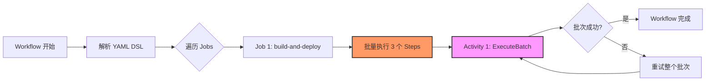

# 单节点执行模式

## 概述 (Overview)

单节点执行模式是 Waterflow 工作流引擎的核心设计决策之一。在这种模式下,每个 YAML DSL 中的 Step 都会被编译为一个独立的 Temporal Activity 调用。这种设计在超时粒度、重试控制和可观测性方面提供了精细的控制,但也带来了一定的性能开销。

**目标用户:**
- 工作流开发者 - 理解 Step 的执行粒度和限制
- 性能优化人员 - 评估性能影响和优化方案
- 架构师 - 理解设计权衡和适用场景

**为什么需要单节点执行模式:**
- 精细的超时控制 - 每个 Step 可以独立配置超时
- 独立的重试策略 - 失败的 Step 可以单独重试,不影响其他 Step
- 高可观测性 - 每个 Step 的执行状态可以单独查询和监控
- 隔离失败 - 一个 Step 失败不会影响其他已完成的 Step

---

## 核心概念 (Core Concepts)

### 单节点执行模式定义

**单节点执行模式** (Single-Node Execution Pattern) 是指:

> 每个 YAML DSL 中的 Step 都会被编译为一个独立的 Temporal Activity 调用,而不是将多个 Step 批量执行。

**关键特性:**
- **1 Step = 1 Activity:** 一对一映射关系
- **串行执行:** Workflow 按顺序调度 Activity (除非显式使用并行特性)
- **独立生命周期:** 每个 Activity 有独立的超时、重试、可观测性

**示例:**

YAML DSL:
```yaml
jobs:
  - name: deploy
    runs-on: linux-amd64
    steps:
      - name: Build Docker Image
        node: docker/exec
        timeout: 300s
      - name: Push to Registry
        node: http/request
        timeout: 60s
      - name: Deploy to Production
        node: exec/shell
        timeout: 600s
```

Temporal Workflow 执行流程:
```go
func (w *WaterflowExecutor) Execute(ctx workflow.Context, input Input) error {
    // Step 1 → Activity 1
    activity1Input := ActivityInput{Node: "docker/exec", ...}
    activity1Output := workflow.ExecuteActivity(ctx, ExecuteNode, activity1Input).Get(&result1)
    
    // Step 2 → Activity 2
    activity2Input := ActivityInput{Node: "http/request", ...}
    activity2Output := workflow.ExecuteActivity(ctx, ExecuteNode, activity2Input).Get(&result2)
    
    // Step 3 → Activity 3
    activity3Input := ActivityInput{Node: "exec/shell", ...}
    activity3Output := workflow.ExecuteActivity(ctx, ExecuteNode, activity3Input).Get(&result3)
    
    return nil
}
```

### 为什么选择单节点而非批处理模式

**批处理模式 (Batch Execution Pattern):**
- 将多个 Step 合并为一个 Activity 调用
- Activity 内部循环执行多个节点
- 超时和重试是批量级别的

**Waterflow 选择单节点模式的原因:**

1. **超时粒度问题** - 批处理模式下,超时是批量级别的,无法为每个 Step 单独配置超时
2. **重试粒度问题** - 批处理失败时,需要重试整个批次,而不是只重试失败的 Step
3. **可观测性问题** - 批处理模式下,无法单独查询每个 Step 的执行状态,只能看到整个批次的状态
4. **失败恢复问题** - 批处理模式下,一个 Step 失败会导致整个批次失败,已完成的 Step 需要重新执行

**架构决策的权衡分析:**

| 决策维度 | 单节点模式 (Waterflow 采用) | 批处理模式 (未采用) |
|---------|---------------------------|-------------------|
| **超时粒度** | ✅ 每个 Step 独立超时 | ❌ 批量超时,粒度粗 |
| **重试粒度** | ✅ 失败的 Step 单独重试 | ❌ 整个批次重试 |
| **可观测性** | ✅ 每个 Step 状态可见 | ❌ 只能看到批次状态 |
| **失败恢复** | ✅ 已完成的 Step 不受影响 | ❌ 需要重新执行已完成的 Step |
| **性能开销** | ⚠️ Activity 数量多,Event History 大 | ✅ Activity 数量少,Event History 小 |
| **编程复杂度** | ✅ 实现简单,逻辑清晰 | ⚠️ 需要复杂的批量执行逻辑 |

**最终决策:** 选择单节点模式,因为可控性和可观测性比性能开销更重要。

---

## 执行流程

### Workflow 如何串行调用多个 Activity

Waterflow Workflow 执行器 (WaterflowExecutor) 的核心逻辑:

```go
func (w *WaterflowExecutor) Execute(ctx workflow.Context, input Input) (*Output, error) {
    // 解析 YAML DSL
    dsl, err := parseDSL(input.YAMLPath)
    if err != nil {
        return nil, err
    }
    
    // 逐个 Job 执行
    for _, job := range dsl.Jobs {
        // 逐个 Step 执行
        for _, step := range job.Steps {
            // 每个 Step → 1 个 Activity 调用
            activityInput := ActivityInput{
                Node:    step.Node,
                Inputs:  step.Inputs,
                Timeout: step.Timeout,
            }
            
            // 配置 Activity 超时
            activityOptions := workflow.ActivityOptions{
                StartToCloseTimeout:    step.Timeout,
                ScheduleToCloseTimeout: step.Timeout + 60*time.Second,
                RetryPolicy:            step.RetryPolicy,
            }
            ctx = workflow.WithActivityOptions(ctx, activityOptions)
            
            // 调用 Activity (串行,等待完成)
            var activityOutput ActivityOutput
            err := workflow.ExecuteActivity(ctx, ExecuteNode, activityInput).Get(ctx, &activityOutput)
            if err != nil {
                // Step 失败处理
                return nil, fmt.Errorf("step %s failed: %w", step.Name, err)
            }
            
            // 保存 Step 输出 (用于后续 Step 的变量引用)
            outputs[step.Name] = activityOutput.Result
        }
    }
    
    return &Output{Status: "success"}, nil
}
```

**关键点:**
1. **串行执行:** `workflow.ExecuteActivity().Get()` 会阻塞,直到 Activity 完成
2. **独立超时:** 每个 Activity 有独立的 `StartToCloseTimeout`
3. **独立重试:** 每个 Activity 有独立的 `RetryPolicy`
4. **失败隔离:** 一个 Activity 失败不会影响其他已完成的 Activity

### 每个 Activity 的独立超时和重试配置

**超时配置:**

YAML DSL:
```yaml
steps:
  - name: Long Running Task
    node: exec/shell
    timeout: 30m  # 30 分钟超时
    retry:
      max_attempts: 3
```

Temporal Activity Options:
```go
activityOptions := workflow.ActivityOptions{
    StartToCloseTimeout:    30 * time.Minute,    // Step 超时
    ScheduleToCloseTimeout: 31 * time.Minute,    // 总超时 (包括调度时间)
    ScheduleToStartTimeout: 1 * time.Minute,     // 调度超时
    RetryPolicy: &temporal.RetryPolicy{
        MaximumAttempts:    3,                    // 最多重试 3 次
        InitialInterval:    1 * time.Second,      // 初始重试间隔
        BackoffCoefficient: 2.0,                  // 指数退避系数
    },
}
```

**重试配置:**

- `max_attempts: 3` → Temporal RetryPolicy `MaximumAttempts: 3`
- `backoff: exponential` → Temporal RetryPolicy `BackoffCoefficient: 2.0`
- `initial_interval: 1s` → Temporal RetryPolicy `InitialInterval: 1s`

### 失败节点的隔离和重试机制

**场景:** Job 有 5 个 Step,第 3 个 Step 失败

```
Job Execution:
  Step 1 → Activity 1 ✅ Completed
  Step 2 → Activity 2 ✅ Completed
  Step 3 → Activity 3 ❌ Failed (Retry 1)
  Step 3 → Activity 3 ❌ Failed (Retry 2)
  Step 3 → Activity 3 ✅ Completed (Retry 3)
  Step 4 → Activity 4 ✅ Completed
  Step 5 → Activity 5 ✅ Completed
```

**关键观察:**
- Step 1 和 Step 2 **不会重新执行** (已完成的 Activity 不受影响)
- Step 3 **单独重试** (根据配置的 `max_attempts`)
- Step 4 和 Step 5 在 Step 3 成功后继续执行

**Event History 示例:**

```
Event 1: ActivityTaskScheduled (Step 1)
Event 2: ActivityTaskCompleted (Step 1)
Event 3: ActivityTaskScheduled (Step 2)
Event 4: ActivityTaskCompleted (Step 2)
Event 5: ActivityTaskScheduled (Step 3)
Event 6: ActivityTaskFailed (Step 3, Attempt 1)
Event 7: ActivityTaskScheduled (Step 3, Retry)
Event 8: ActivityTaskFailed (Step 3, Attempt 2)
Event 9: ActivityTaskScheduled (Step 3, Retry)
Event 10: ActivityTaskCompleted (Step 3, Attempt 3)
Event 11: ActivityTaskScheduled (Step 4)
Event 12: ActivityTaskCompleted (Step 4)
```

---

## 与批处理模式对比

### 单节点 vs 批处理 表格对比

| 对比维度 | 单节点执行模式 | 批处理执行模式 |
|---------|---------------|---------------|
| **超时粒度** | ✅ 每个 Step 独立超时配置 | ❌ 批量超时,无法为单个 Step 配置 |
| **重试粒度** | ✅ 失败的 Step 单独重试 | ❌ 整个批次重试,已完成的 Step 也需要重新执行 |
| **可观测性** | ✅ Temporal UI 可以查看每个 Step 的状态 | ❌ 只能看到批次级别的状态 |
| **失败恢复** | ✅ 已完成的 Step 不受影响 | ❌ 批次失败后,所有 Step 需要重新执行 |
| **并发控制** | ✅ 可以精细控制 Step 的并发执行 | ⚠️ 批量内部的并发控制复杂 |
| **Activity 数量** | ⚠️ 1 Step = 1 Activity,数量多 | ✅ 多个 Step = 1 Activity,数量少 |
| **Event History 大小** | ⚠️ 每个 Step 产生多个 Event,体积大 | ✅ 批次产生的 Event 少,体积小 |
| **性能影响** | ⚠️ Activity 调度开销大 | ✅ Activity 调度开销小 |
| **编程复杂度** | ✅ 实现简单,逻辑清晰 | ⚠️ 需要复杂的批量执行逻辑 |
| **适用场景** | ✅ 长时间运行、高可靠性要求的工作流 | ✅ 短时间运行、大量小任务的工作流 |

### 性能影响分析: Activity 数量 vs Event History 大小

**测试场景:** 100 个 Step 的工作流

**单节点模式:**
- Activity 数量: **100 个**
- Event History 大小: **约 500-600 个事件** (每个 Activity 产生 5-6 个事件)
- Event History 体积: **约 500KB - 1MB** (取决于 Step 输出大小)
- 调度开销: **约 100ms - 200ms** (每个 Activity 调度开销 1-2ms)

**批处理模式 (假设 10 个 Step 一批):**
- Activity 数量: **10 个**
- Event History 大小: **约 50-60 个事件**
- Event History 体积: **约 50KB - 100KB**
- 调度开销: **约 10ms - 20ms**

**Temporal 官方性能数据:**
- Temporal 支持 **10,000+ Activities** 的 Workflow
- Event History 支持 **百万级事件** (推荐使用 Continue-As-New 优化)
- Activity 调度延迟: **< 10ms** (P99)

**结论:**
- 对于中小型工作流 (< 1000 Steps),单节点模式的性能影响 **可接受**
- 对于大型工作流 (> 1000 Steps),建议使用 **Job 分批** 或 **子工作流** 优化
- Waterflow 的典型场景 (部署、监控、备份) 通常 < 100 Steps,单节点模式 **完全满足需求**

---

## 实际示例

### 示例 1: YAML 工作流定义 → Temporal Workflow 代码映射

**YAML DSL:**

```yaml
name: deploy-wordpress
jobs:
  - name: build-and-deploy
    runs-on: linux-amd64
    steps:
      - name: Build Docker Image
        node: docker/exec
        inputs:
          command: build
          tag: wordpress:latest
        timeout: 5m
        retry:
          max_attempts: 2

      - name: Push to Registry
        node: http/request
        inputs:
          url: https://registry.example.com/v2/wordpress/manifests/latest
          method: PUT
        timeout: 1m
        retry:
          max_attempts: 3

      - name: Deploy to Production
        node: exec/shell
        inputs:
          command: kubectl apply -f wordpress-deployment.yaml
        timeout: 10m
        retry:
          max_attempts: 1
```

**Temporal Workflow 代码映射:**

```go
func (w *WaterflowExecutor) Execute(ctx workflow.Context, input Input) (*Output, error) {
    // Job: build-and-deploy
    
    // ======== Step 1: Build Docker Image ========
    step1Options := workflow.ActivityOptions{
        StartToCloseTimeout:    5 * time.Minute,
        ScheduleToCloseTimeout: 6 * time.Minute,
        RetryPolicy: &temporal.RetryPolicy{
            MaximumAttempts:    2,
            InitialInterval:    1 * time.Second,
            BackoffCoefficient: 2.0,
        },
    }
    ctx1 := workflow.WithActivityOptions(ctx, step1Options)
    
    step1Input := ActivityInput{
        Node: "docker/exec",
        Inputs: map[string]interface{}{
            "command": "build",
            "tag":     "wordpress:latest",
        },
    }
    
    var step1Output ActivityOutput
    err := workflow.ExecuteActivity(ctx1, ExecuteNode, step1Input).Get(ctx, &step1Output)
    if err != nil {
        return nil, fmt.Errorf("step Build Docker Image failed: %w", err)
    }
    
    // ======== Step 2: Push to Registry ========
    step2Options := workflow.ActivityOptions{
        StartToCloseTimeout:    1 * time.Minute,
        ScheduleToCloseTimeout: 2 * time.Minute,
        RetryPolicy: &temporal.RetryPolicy{
            MaximumAttempts:    3,
            InitialInterval:    1 * time.Second,
            BackoffCoefficient: 2.0,
        },
    }
    ctx2 := workflow.WithActivityOptions(ctx, step2Options)
    
    step2Input := ActivityInput{
        Node: "http/request",
        Inputs: map[string]interface{}{
            "url":    "https://registry.example.com/v2/wordpress/manifests/latest",
            "method": "PUT",
        },
    }
    
    var step2Output ActivityOutput
    err = workflow.ExecuteActivity(ctx2, ExecuteNode, step2Input).Get(ctx, &step2Output)
    if err != nil {
        return nil, fmt.Errorf("step Push to Registry failed: %w", err)
    }
    
    // ======== Step 3: Deploy to Production ========
    step3Options := workflow.ActivityOptions{
        StartToCloseTimeout:    10 * time.Minute,
        ScheduleToCloseTimeout: 11 * time.Minute,
        RetryPolicy: &temporal.RetryPolicy{
            MaximumAttempts:    1,
            InitialInterval:    1 * time.Second,
        },
    }
    ctx3 := workflow.WithActivityOptions(ctx, step3Options)
    
    step3Input := ActivityInput{
        Node: "exec/shell",
        Inputs: map[string]interface{}{
            "command": "kubectl apply -f wordpress-deployment.yaml",
        },
    }
    
    var step3Output ActivityOutput
    err = workflow.ExecuteActivity(ctx3, ExecuteNode, step3Input).Get(ctx, &step3Output)
    if err != nil {
        return nil, fmt.Errorf("step Deploy to Production failed: %w", err)
    }
    
    return &Output{Status: "success"}, nil
}
```

**关键映射:**
- `timeout: 5m` → `StartToCloseTimeout: 5 * time.Minute`
- `retry.max_attempts: 2` → `RetryPolicy.MaximumAttempts: 2`
- `node: docker/exec` → `ActivityInput.Node: "docker/exec"`

### 示例 2: Temporal UI 中单节点执行的截图说明

**Temporal UI - Workflow Execution History:**

```
┌─────────────────────────────────────────────────────────────┐
│ Workflow: deploy-wordpress-20260115-100000                  │
│ Status: Completed                                           │
│ Duration: 16m 23s                                           │
├─────────────────────────────────────────────────────────────┤
│ Event Timeline:                                             │
│                                                             │
│ 1. WorkflowExecutionStarted          10:00:00              │
│ 2. WorkflowTaskScheduled             10:00:00              │
│ 3. WorkflowTaskStarted               10:00:01              │
│ 4. WorkflowTaskCompleted             10:00:01              │
│ 5. ActivityTaskScheduled             10:00:01              │
│    ├─ Activity: ExecuteNode                                │
│    ├─ Input: {node: docker/exec, ...}                      │
│    └─ Timeout: 5m                                          │
│ 6. ActivityTaskStarted               10:00:02              │
│ 7. ActivityTaskCompleted             10:04:58 (4m 56s)     │
│    └─ Output: {status: success, ...}                       │
│                                                             │
│ 8. WorkflowTaskScheduled             10:04:58              │
│ 9. WorkflowTaskStarted               10:04:58              │
│ 10. WorkflowTaskCompleted            10:04:59              │
│ 11. ActivityTaskScheduled            10:04:59              │
│     ├─ Activity: ExecuteNode                               │
│     ├─ Input: {node: http/request, ...}                    │
│     └─ Timeout: 1m                                         │
│ 12. ActivityTaskStarted              10:05:00              │
│ 13. ActivityTaskCompleted            10:05:12 (12s)        │
│     └─ Output: {status: success, ...}                      │
│                                                             │
│ 14. WorkflowTaskScheduled            10:05:12              │
│ 15. WorkflowTaskStarted              10:05:12              │
│ 16. WorkflowTaskCompleted            10:05:13              │
│ 17. ActivityTaskScheduled            10:05:13              │
│     ├─ Activity: ExecuteNode                               │
│     ├─ Input: {node: exec/shell, ...}                      │
│     └─ Timeout: 10m                                        │
│ 18. ActivityTaskStarted              10:05:14              │
│ 19. ActivityTaskCompleted            10:15:37 (10m 23s)    │
│     └─ Output: {status: success, ...}                      │
│                                                             │
│ 20. WorkflowTaskScheduled            10:15:37              │
│ 21. WorkflowTaskStarted              10:15:37              │
│ 22. WorkflowTaskCompleted            10:15:38              │
│ 23. WorkflowExecutionCompleted       10:15:38              │
└─────────────────────────────────────────────────────────────┘
```

**观察:**
- 每个 Step 对应 5-6 个事件 (Scheduled → Started → Completed)
- 可以清晰看到每个 Step 的执行时间和状态
- 失败的 Step 会显示重试事件 (ActivityTaskFailed → ActivityTaskScheduled)

### 示例 3: 失败 Step 重试的 Event History 示例

**场景:** Step 2 失败 2 次,第 3 次成功

```
Event 11: ActivityTaskScheduled (Step 2: Push to Registry)
Event 12: ActivityTaskStarted
Event 13: ActivityTaskFailed
          ├─ Error: connection timeout
          ├─ Attempt: 1/3
          └─ RetryIn: 1s

Event 14: ActivityTaskScheduled (Step 2: Retry 1)
Event 15: ActivityTaskStarted
Event 16: ActivityTaskFailed
          ├─ Error: connection timeout
          ├─ Attempt: 2/3
          └─ RetryIn: 2s

Event 17: ActivityTaskScheduled (Step 2: Retry 2)
Event 18: ActivityTaskStarted
Event 19: ActivityTaskCompleted
          ├─ Attempt: 3/3
          └─ Output: {status: success}

Event 20: WorkflowTaskScheduled
Event 21: WorkflowTaskCompleted
Event 22: ActivityTaskScheduled (Step 3: Deploy to Production)
```

**关键点:**
- Step 1 的事件不受影响 (Event 1-10)
- Step 2 重试 3 次 (Event 11-19)
- Step 3 在 Step 2 成功后继续执行 (Event 22)

---

## 架构图表

### 单节点执行流程图

```mermaid
graph LR
    A[Workflow 开始] --> B[解析 YAML DSL]
    B --> C{遍历 Jobs}
    C --> D[Job 1: build-and-deploy]
    D --> E{遍历 Steps}
    
    E --> F1[Step 1: Build Docker Image]
    F1 --> G1[Activity 1: ExecuteNode]
    G1 --> H1{成功?}
    H1 -->|是| I1[保存输出]
    H1 -->|否| J1[重试/失败]
    
    I1 --> F2[Step 2: Push to Registry]
    F2 --> G2[Activity 2: ExecuteNode]
    G2 --> H2{成功?}
    H2 -->|是| I2[保存输出]
    H2 -->|否| J2[重试/失败]
    
    I2 --> F3[Step 3: Deploy to Production]
    F3 --> G3[Activity 3: ExecuteNode]
    G3 --> H3{成功?}
    H3 -->|是| I3[保存输出]
    H3 -->|否| J3[重试/失败]
    
    I3 --> K[Workflow 完成]
    
    style F1 fill:#bbf,stroke:#333,stroke-width:2px
    style F2 fill:#bbf,stroke:#333,stroke-width:2px
    style F3 fill:#bbf,stroke:#333,stroke-width:2px
    style G1 fill:#f9f,stroke:#333,stroke-width:2px
    style G2 fill:#f9f,stroke:#333,stroke-width:2px
    style G3 fill:#f9f,stroke:#333,stroke-width:2px
```



### 批处理执行流程图 (对比)



### 超时和重试机制图

```
单节点执行模式的超时和重试:

┌──────────────────────────────────────────────────────────────┐
│ Workflow: WaterflowExecutor                                   │
│                                                               │
│  Step 1 (Timeout: 5m, MaxAttempts: 2)                        │
│  ├─ Attempt 1: ✅ Success (4m 56s)                           │
│  └─ Result: {status: success}                                │
│                                                               │
│  Step 2 (Timeout: 1m, MaxAttempts: 3)                        │
│  ├─ Attempt 1: ❌ Timeout (1m 0s)                            │
│  ├─ Wait: 1s (exponential backoff)                           │
│  ├─ Attempt 2: ❌ Timeout (1m 0s)                            │
│  ├─ Wait: 2s (exponential backoff)                           │
│  └─ Attempt 3: ✅ Success (45s)                              │
│                                                               │
│  Step 3 (Timeout: 10m, MaxAttempts: 1)                       │
│  └─ Attempt 1: ✅ Success (10m 23s)                          │
│                                                               │
│  Total Duration: 16m 23s                                     │
└──────────────────────────────────────────────────────────────┘

批处理模式的超时和重试 (对比):

┌──────────────────────────────────────────────────────────────┐
│ Workflow: BatchExecutor                                       │
│                                                               │
│  Batch 1 (Timeout: 16m, MaxAttempts: 3)                      │
│  ├─ Attempt 1: ❌ Timeout (16m 0s)                           │
│  │  ├─ Step 1: ✅ Success (4m 56s)                           │
│  │  ├─ Step 2: ❌ Timeout (1m 0s)                            │
│  │  └─ Step 3: Not executed (batch failed)                   │
│  ├─ Wait: 5s                                                  │
│  ├─ Attempt 2: ❌ Timeout (16m 0s)                           │
│  │  ├─ Step 1: ✅ Success (4m 56s) ⚠️ 重复执行              │
│  │  ├─ Step 2: ❌ Timeout (1m 0s)                            │
│  │  └─ Step 3: Not executed                                  │
│  ├─ Wait: 10s                                                 │
│  └─ Attempt 3: ✅ Success (16m 14s)                          │
│     ├─ Step 1: ✅ Success (4m 56s) ⚠️ 重复执行              │
│     ├─ Step 2: ✅ Success (45s)                              │
│     └─ Step 3: ✅ Success (10m 23s)                          │
│                                                               │
│  Total Duration: 48m 14s ⚠️ 浪费了 32m                      │
└──────────────────────────────────────────────────────────────┘
```

---

## 交叉引用 (References)

### 架构设计文档
- [ADR-0001: 使用 Temporal 作为工作流引擎](../adr/0001-use-temporal-workflow-engine.md) - Temporal Activity 执行模型基础
- [ADR-0002: 单节点执行模式](../adr/0002-single-node-execution-pattern.md) - 架构决策详细分析
- [Story 1.7: 超时和重试策略](../sprint-artifacts/1-7-timeout-and-retry-strategy.md) - 超时和重试实现细节
- [Story 1.8: Temporal SDK 集成和工作流执行引擎](../sprint-artifacts/1-8-temporal-sdk-integration.md) - Workflow 执行引擎实现

### DSL 语法参考
- [DSL Syntax - Step 配置](../yaml-dsl-reference.md#step-配置) - Step 的 YAML 语法
- [DSL Syntax - 超时和重试](../yaml-dsl-reference.md#超时和重试) - 超时和重试配置语法

### 相关概念
- [Event Sourcing 执行模型](./event-sourcing-execution-model.md) - 理解 Workflow 的状态存储机制
- [Task Queue 路由机制](./task-queue-routing.md) - 理解 Activity 如何分发到 Agent

---

**Last Updated:** 2026-01-15  
**Document Version:** 1.0  
**Author:** Waterflow Team
