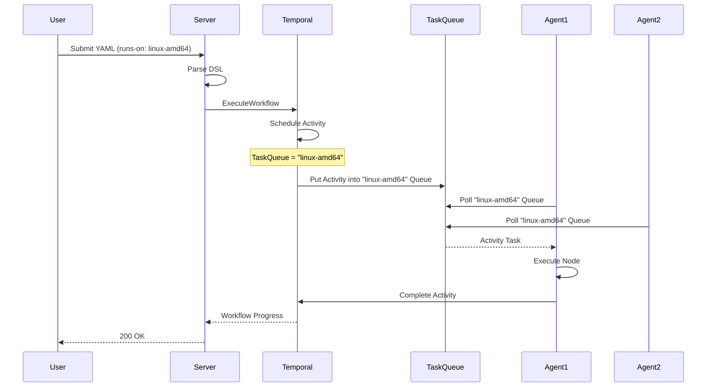
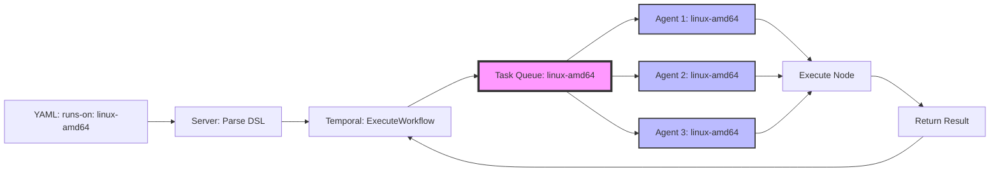

# Task Queue 路由机制

## 概述 (Overview)

Task Queue 路由机制是 Waterflow 分布式执行的核心设计。通过将 YAML DSL 中的 `runs-on` 字段直接映射到 Temporal Task Queue 名称,Waterflow 实现了零配置、高度灵活的跨服务器工作流编排。

**目标用户:**
- 分布式部署用户 - 理解如何在多台服务器上执行工作流
- 运维工程师 - 配置 Agent 和 Task Queue 映射
- 架构师 - 评估路由机制的设计和适用场景

**为什么需要 Task Queue 路由机制:**
- 跨服务器编排 - 一个工作流可以在不同的服务器上执行不同的 Step
- 零配置路由 - 无需复杂的路由规则,`runs-on` 直接决定目标 Agent
- 灵活的服务器组 - Agent 可以动态注册到多个 Task Queue
- Temporal 原生负载均衡 - 多个 Agent 注册到同一 Queue 自动负载均衡

---

## 核心概念 (Core Concepts)

### Temporal Task Queue 机制介绍

**Temporal Task Queue** 是 Temporal 的核心概念之一,用于将任务分发给 Worker (Agent):

**核心原理:**
1. **Workflow 调度 Activity** → Temporal Server 将 Activity 放入指定的 Task Queue
2. **Agent Worker 监听 Queue** → Agent 从 Task Queue 拉取任务并执行
3. **原生负载均衡** → 多个 Worker 监听同一 Queue,Temporal 自动负载均衡

**Task Queue 特性:**
- **命名空间隔离:** 每个 Namespace 有独立的 Task Queue 空间
- **动态创建:** Task Queue 无需预先创建,首次使用时自动创建
- **长轮询 (Long Polling):** Worker 使用长轮询机制拉取任务,减少网络开销
- **公平调度:** 多个 Worker 时,Temporal 确保任务公平分配

**示例:**

```go
// Workflow 调度 Activity 到 "linux-amd64" Task Queue
activityOptions := workflow.ActivityOptions{
    TaskQueue: "linux-amd64",
}
ctx = workflow.WithActivityOptions(ctx, activityOptions)
workflow.ExecuteActivity(ctx, ExecuteNode, input).Get(ctx, &output)

// Agent Worker 注册到 "linux-amd64" Task Queue
worker := worker.New(client, "linux-amd64", worker.Options{})
worker.RegisterActivity(ExecuteNode)
worker.Start()
```

### `runs-on` 字段如何直接映射到 Task Queue 名称

Waterflow 的核心设计决策:**`runs-on` 字段的值 = Temporal Task Queue 名称`**

**YAML DSL:**

```yaml
jobs:
  - name: deploy-frontend
    runs-on: linux-amd64  # ← 直接映射到 Task Queue "linux-amd64"
    steps:
      - name: Build React App
        node: exec/shell
        inputs:
          command: npm run build
```

**Temporal Workflow 代码:**

```go
func (w *WaterflowExecutor) Execute(ctx workflow.Context, input Input) error {
    for _, job := range input.Jobs {
        // 直接使用 runs-on 作为 Task Queue 名称
        taskQueue := job.RunsOn  // "linux-amd64"
        
        for _, step := range job.Steps {
            activityOptions := workflow.ActivityOptions{
                TaskQueue:              taskQueue,  // "linux-amd64"
                StartToCloseTimeout:    step.Timeout,
            }
            ctx = workflow.WithActivityOptions(ctx, activityOptions)
            
            var output ActivityOutput
            err := workflow.ExecuteActivity(ctx, ExecuteNode, step).Get(ctx, &output)
            if err != nil {
                return err
            }
        }
    }
    return nil
}
```

**关键点:**
- `runs-on: linux-amd64` → `TaskQueue: "linux-amd64"`
- `runs-on: windows-server` → `TaskQueue: "windows-server"`
- `runs-on: gpu-a100` → `TaskQueue: "gpu-a100"`
- **完全灵活:** 用户可以使用任意名称,无需预先配置

### 零配置路由的设计理念

**传统路由方案的问题:**

1. **标签匹配 (Label Matching):**
   - 需要预先配置服务器标签 (如 `os=linux`, `arch=amd64`)
   - 需要复杂的匹配规则 (如 `os=linux AND arch=amd64 AND env=production`)
   - 配置繁琐,容易出错

2. **预定义 Queue:**
   - 需要预先创建所有可能的 Task Queue
   - 新增服务器组需要修改配置文件
   - 不够灵活

**Waterflow 的零配置路由:**

- **直接映射:** `runs-on` 的值直接作为 Task Queue 名称
- **无需配置:** Task Queue 不需要预先创建,首次使用时自动创建
- **完全灵活:** 用户可以使用任意名称,如 `runs-on: my-custom-server-group`
- **简单直观:** 一看 YAML 就知道任务会在哪个服务器组上执行

**示例对比:**

| 方案 | YAML 配置 | Agent 配置 | 路由逻辑 |
|------|----------|-----------|---------|
| **直接映射 (Waterflow)** | `runs-on: linux-amd64` | `task-queues: [linux-amd64]` | ✅ 零配置,直接匹配 |
| **标签匹配** | `runs-on: {os: linux, arch: amd64}` | `labels: {os: linux, arch: amd64}` | ⚠️ 需要复杂的匹配规则 |
| **预定义 Queue** | `runs-on: prod-linux-amd64` | `queues: [prod-linux-amd64]` | ⚠️ 需要预先创建 Queue |

---

## 路由流程

### 路由流程详解 (YAML → Temporal Task Queue → Agent)

完整的路由流程:



**步骤详解:**

1. **用户提交工作流:**
   ```bash
   waterflow-cli submit deploy.yaml
   ```

2. **Server 解析 DSL:**
   ```go
   dsl, err := parser.Parse("deploy.yaml")
   job := dsl.Jobs[0]
   taskQueue := job.RunsOn  // "linux-amd64"
   ```

3. **Temporal 调度 Activity:**
   ```go
   activityOptions := workflow.ActivityOptions{
       TaskQueue: "linux-amd64",
   }
   workflow.ExecuteActivity(ctx, ExecuteNode, input)
   ```

4. **Activity 进入 Task Queue:**
   - Temporal Server 将 Activity 放入 `linux-amd64` Task Queue
   - Task Queue 在 Temporal 内部表示为一个待执行任务列表

5. **Agent 拉取任务:**
   ```go
   // Agent 启动时注册到 "linux-amd64" Task Queue
   worker := worker.New(client, "linux-amd64", worker.Options{})
   worker.Start()  // 开始轮询 Task Queue
   ```

6. **Agent 执行任务:**
   - Agent 拉取到 Activity 任务
   - 执行节点逻辑 (如 `exec/shell`)
   - 将结果返回给 Temporal

7. **Workflow 继续执行:**
   - Temporal 接收到 Activity 结果
   - Workflow 继续执行下一个 Step

### 服务器组 (Server Group) 概念

**服务器组 (Server Group)** 是 Waterflow 中的逻辑概念,表示一组功能相似的服务器:

**示例:**
- `linux-amd64` - Linux x86_64 架构服务器
- `windows-server` - Windows Server 服务器
- `gpu-a100` - 带有 NVIDIA A100 GPU 的服务器
- `webserver-prod` - 生产环境的 Web 服务器

**服务器组与 Task Queue 的映射关系:**

```
服务器组 (逻辑概念)     →    Task Queue (Temporal 概念)
┌──────────────────┐         ┌──────────────────┐
│ linux-amd64      │    →    │ linux-amd64      │
│ (3 台服务器)     │         │ (Task Queue)     │
└──────────────────┘         └──────────────────┘
        ↑                            ↓
    ┌───┴───┐                  ┌─────────┐
    │ Agent1│                  │ Activity│
    │ Agent2│  ←── Poll ───    │ Activity│
    │ Agent3│                  │ Activity│
    └───────┘                  └─────────┘
```

**关键点:**
- 服务器组是用户定义的逻辑概念 (如 "生产环境的 Web 服务器")
- Task Queue 是 Temporal 的实现机制
- Waterflow 通过 `runs-on` 将两者映射起来

### 单个 Agent 注册到多个 Task Queue

**场景:** 一台服务器可以执行多种类型的任务

**示例:** 一台 Linux 服务器同时具有:
- 通用 Linux 功能 → 注册到 `linux-amd64` Queue
- Docker 执行能力 → 注册到 `docker-enabled` Queue
- GPU 加速能力 → 注册到 `gpu-a100` Queue

**Agent 配置:**

```yaml
# /etc/waterflow/agent.yaml
task-queues:
  - linux-amd64
  - docker-enabled
  - gpu-a100
```

**Agent 启动代码:**

```go
func (a *Agent) Start() error {
    // 为每个 Task Queue 创建一个 Worker
    for _, taskQueue := range a.Config.TaskQueues {
        worker := worker.New(a.TemporalClient, taskQueue, worker.Options{
            MaxConcurrentActivityExecutionSize: a.Config.MaxConcurrent,
        })
        
        worker.RegisterActivity(ExecuteNode)
        
        if err := worker.Start(); err != nil {
            return fmt.Errorf("failed to start worker for queue %s: %w", taskQueue, err)
        }
        
        a.workers = append(a.workers, worker)
        log.Infof("Worker started for task queue: %s", taskQueue)
    }
    
    return nil
}
```

**使用场景:**

工作流可以根据任务类型选择合适的 Queue:

```yaml
jobs:
  - name: build-app
    runs-on: docker-enabled  # 需要 Docker 的任务
    steps:
      - name: Build Docker Image
        node: docker/exec
        inputs:
          command: build

  - name: train-model
    runs-on: gpu-a100  # 需要 GPU 的任务
    steps:
      - name: Train ML Model
        node: exec/shell
        inputs:
          command: python train.py --gpu

  - name: deploy-app
    runs-on: linux-amd64  # 通用 Linux 任务
    steps:
      - name: Deploy to Production
        node: exec/shell
        inputs:
          command: kubectl apply -f deployment.yaml
```

### 多个 Agent 注册到同一 Task Queue (负载均衡)

**场景:** 多台服务器执行相同类型的任务,需要负载均衡

**示例:** 3 台 Web 服务器都注册到 `webserver-prod` Queue

**Agent 配置 (3 台服务器相同):**

```yaml
# /etc/waterflow/agent.yaml (Server 1/2/3 都使用相同配置)
task-queues:
  - webserver-prod
```

**Temporal 自动负载均衡:**

```
Task Queue: webserver-prod
┌───────────────────────┐
│ Activity 1            │
│ Activity 2            │  ← Temporal 自动分配给空闲的 Agent
│ Activity 3            │
│ Activity 4            │
│ Activity 5            │
└───────────────────────┘
         ↓
    ┌────┴────┐
    │         │
    ↓         ↓         ↓
┌───────┐ ┌───────┐ ┌───────┐
│Agent 1│ │Agent 2│ │Agent 3│
│ Act 1 │ │ Act 2 │ │ Act 3 │
│ Act 4 │ │ Act 5 │ │       │
└───────┘ └───────┘ └───────┘
```

**Temporal 负载均衡策略:**
- **公平分配:** 任务尽量均匀分配给所有 Agent
- **优先空闲:** 空闲的 Agent 优先分配任务
- **长轮询优化:** 减少网络往返次数

**使用场景:**

工作流无需关心具体哪台服务器执行,只需指定服务器组:

```yaml
jobs:
  - name: deploy-to-webservers
    runs-on: webserver-prod  # Temporal 自动分配给 3 台中的一台
    steps:
      - name: Deploy Application
        node: exec/shell
        inputs:
          command: /deploy/deploy.sh
```

### 动态添加新服务器组的流程

**场景:** 新增一个 GPU 服务器,需要执行 ML 训练任务

**步骤 1:** 安装和配置 Agent

```bash
# 在新服务器上安装 Waterflow Agent
curl -sSL https://get.waterflow.dev/agent | bash

# 配置 Agent
sudo vim /etc/waterflow/agent.yaml
```

**步骤 2:** 配置 Task Queue

```yaml
# /etc/waterflow/agent.yaml
temporal:
  server: temporal.example.com:7233
  namespace: default

task-queues:
  - gpu-v100  # 新的 Task Queue 名称
  - linux-amd64  # 可以同时注册到多个 Queue

max-concurrent: 5
```

**步骤 3:** 启动 Agent

```bash
# 启动 Agent
sudo systemctl start waterflow-agent

# 验证 Agent 启动成功
sudo systemctl status waterflow-agent

# 查看日志,确认注册到 Task Queue
sudo journalctl -u waterflow-agent -f
# Expected output:
# Worker started for task queue: gpu-v100
# Worker started for task queue: linux-amd64
```

**步骤 4:** 在工作流中使用新服务器组

```yaml
jobs:
  - name: train-model
    runs-on: gpu-v100  # 新的服务器组,无需其他配置
    steps:
      - name: Train ML Model
        node: exec/shell
        inputs:
          command: python train.py --gpu
```

**关键点:**
- **零 Server 配置:** Server 无需配置新的 Task Queue
- **动态创建:** Task Queue 在首次使用时自动创建
- **立即可用:** Agent 启动后立即可以接收任务

---

## 与其他路由方案对比

### 直接映射 vs 标签匹配 vs 预定义 Queue 表格

| 对比维度 | 直接映射 (Waterflow) | 标签匹配 | 预定义 Queue |
|---------|---------------------|---------|-------------|
| **配置复杂度** | ✅ 极简 - 只需设置 `runs-on` 和 `task-queues` | ⚠️ 复杂 - 需要配置标签和匹配规则 | ⚠️ 中等 - 需要预先创建 Queue |
| **灵活性** | ✅ 完全灵活 - 可以使用任意名称 | ✅ 灵活 - 支持复杂的匹配规则 | ❌ 不灵活 - 需要预先定义 |
| **动态扩展** | ✅ 零配置 - 新增 Agent 立即可用 | ⚠️ 需要配置标签 | ⚠️ 需要创建新 Queue |
| **可读性** | ✅ 一目了然 - `runs-on` 直接表达意图 | ⚠️ 需要理解标签匹配规则 | ✅ 清晰 - Queue 名称明确 |
| **错误处理** | ⚠️ 无效 Queue 会一直等待 | ⚠️ 标签不匹配会失败 | ⚠️ Queue 不存在会失败 |
| **负载均衡** | ✅ Temporal 原生支持 | ⚠️ 需要自己实现 | ✅ Temporal 原生支持 |
| **跨服务器编排** | ✅ 简单 - 每个 Job 指定 `runs-on` | ⚠️ 复杂 - 需要管理多组标签 | ✅ 简单 - 每个 Job 指定 Queue |
| **适用场景** | ✅ 中小型部署,简单直观 | ✅ 大型部署,复杂需求 | ✅ 传统 CI/CD 系统 |

### 优势: 简单、灵活、零配置

**1. 简单:**
- YAML 配置只需 `runs-on: <name>`
- Agent 配置只需 `task-queues: [<name>]`
- 无需额外的路由配置文件

**2. 灵活:**
- 可以使用任意名称,如 `runs-on: my-custom-server-group`
- 一个 Agent 可以注册到多个 Queue
- 多个 Agent 可以注册到同一 Queue

**3. 零配置:**
- Task Queue 不需要预先创建
- 新增服务器组只需启动 Agent,无需修改 Server 配置
- 完全基于 Temporal 的原生能力

### 劣势: Queue 名称管理、无效 Queue 等待

**1. Queue 名称管理:**

**问题:** 没有集中的 Queue 名称注册表,容易出现拼写错误

```yaml
# 用户在 YAML 中拼写错误
jobs:
  - name: deploy
    runs-on: linxu-amd64  # 拼写错误,应该是 linux-amd64
```

**影响:** 工作流会一直等待,因为没有 Agent 监听 `linxu-amd64` Queue

**缓解方案:**
- 提供 CLI 命令查询可用的 Task Queue
- Server 定期检查长时间未执行的工作流,发送告警
- 在文档中提供推荐的 Queue 命名规范

**2. 无效 Queue 等待:**

**问题:** 如果 `runs-on` 指定的 Queue 没有 Agent 监听,工作流会一直等待

```yaml
jobs:
  - name: train
    runs-on: gpu-a100  # 没有 Agent 注册到这个 Queue
```

**影响:** 工作流状态为 Running,但实际没有 Agent 执行

**缓解方案:**
- Server 在提交工作流时查询 Temporal,检查 Queue 是否有活跃的 Worker
- 如果没有活跃的 Worker,返回警告: "Warning: No agent is listening on queue 'gpu-a100'"
- 提供 `waterflow-cli queues list` 命令查看所有活跃的 Queue 和 Worker 数量

---

## 实际示例

### 示例 1: 跨服务器编排的 YAML 示例 (Web Server + DB Server)

**场景:** 部署一个 WordPress 应用,需要在不同的服务器上执行不同的任务:
- Web 服务器 - 部署 WordPress 容器
- DB 服务器 - 初始化 MySQL 数据库

**工作流定义 (`deploy-wordpress.yaml`):**

```yaml
name: deploy-wordpress
jobs:
  - name: prepare-database
    runs-on: db-server  # 在 DB 服务器上执行
    steps:
      - name: Create Database
        node: exec/shell
        inputs:
          command: |
            mysql -u root -p$DB_PASSWORD -e "CREATE DATABASE IF NOT EXISTS wordpress;"
            mysql -u root -p$DB_PASSWORD -e "GRANT ALL ON wordpress.* TO 'wp_user'@'%';"
        outputs:
          db_status: "{{ outputs.exit_code }}"

      - name: Verify Database
        node: exec/shell
        inputs:
          command: mysql -u wp_user -p$DB_PASSWORD -e "SHOW DATABASES LIKE 'wordpress';"

  - name: deploy-wordpress
    runs-on: web-server  # 在 Web 服务器上执行
    depends-on: [prepare-database]  # 等待数据库准备完成
    steps:
      - name: Pull WordPress Image
        node: docker/exec
        inputs:
          command: pull
          image: wordpress:latest

      - name: Start WordPress Container
        node: docker/compose
        inputs:
          file: /opt/wordpress/docker-compose.yml
          command: up -d
        outputs:
          container_id: "{{ outputs.container_id }}"

      - name: Verify WordPress
        node: http/request
        inputs:
          url: http://localhost:8080
          method: GET
        retry:
          max_attempts: 5
          initial_interval: 5s
```

**Agent 配置:**

DB 服务器 (`db-server-01`):
```yaml
# /etc/waterflow/agent.yaml
task-queues:
  - db-server
```

Web 服务器 (`web-server-01`):
```yaml
# /etc/waterflow/agent.yaml
task-queues:
  - web-server
```

**执行流程:**

```
1. Job: prepare-database (runs-on: db-server)
   └─ Temporal 调度到 Task Queue: db-server
   └─ db-server-01 Agent 执行
   
2. Job: deploy-wordpress (runs-on: web-server)
   └─ 等待 prepare-database 完成
   └─ Temporal 调度到 Task Queue: web-server
   └─ web-server-01 Agent 执行
```

### 示例 2: Agent 多 Queue 注册的配置示例

**场景:** 一台多功能服务器可以执行多种类型的任务

**Agent 配置 (`/etc/waterflow/agent.yaml`):**

```yaml
temporal:
  server: temporal.example.com:7233
  namespace: production

task-queues:
  - linux-amd64     # 通用 Linux 任务
  - docker-enabled  # Docker 执行任务
  - webserver-prod  # Web 服务器部署任务

max-concurrent: 10
```

**工作流使用示例:**

```yaml
# 工作流 1: 部署 Docker 应用
name: deploy-docker-app
jobs:
  - name: build-and-deploy
    runs-on: docker-enabled  # 使用 docker-enabled Queue
    steps:
      - name: Build Image
        node: docker/exec
        inputs:
          command: build -t myapp:latest .

# 工作流 2: 通用 Linux 任务
name: backup-files
jobs:
  - name: backup
    runs-on: linux-amd64  # 使用 linux-amd64 Queue
    steps:
      - name: Backup
        node: exec/shell
        inputs:
          command: tar -czf /backup/data.tar.gz /data

# 工作流 3: Web 服务器部署
name: deploy-webserver
jobs:
  - name: deploy
    runs-on: webserver-prod  # 使用 webserver-prod Queue
    steps:
      - name: Deploy
        node: exec/shell
        inputs:
          command: kubectl apply -f webserver-deployment.yaml
```

**关键点:**
- 一个 Agent 可以处理 3 种不同类型的任务
- 工作流根据任务类型选择合适的 Queue
- Agent 并发执行多个任务 (max-concurrent: 10)

### 示例 3: Temporal UI 中 Task Queue 状态查看

**访问 Temporal UI:**

```bash
# 访问 Temporal UI (默认端口 8088)
open http://localhost:8088
```

**查看 Task Queue 列表:**

1. 导航到 Temporal UI → Task Queues
2. 查看所有活跃的 Task Queue 和 Worker 数量

```
┌──────────────────────────────────────────────────────────┐
│ Task Queues                                              │
├──────────────────────────────────────────────────────────┤
│ Name             | Workers | Pending Tasks | Backlog    │
├──────────────────────────────────────────────────────────┤
│ linux-amd64      |    3    |       5       |     12     │
│ docker-enabled   |    2    |       2       |      8     │
│ webserver-prod   |    3    |       0       |      0     │
│ db-server        |    1    |       1       |      3     │
│ gpu-a100         |    0    |       0       |      0     │ ⚠️ 无 Worker
└──────────────────────────────────────────────────────────┘
```

**查看 Task Queue 详情:**

点击 Task Queue 名称 (如 `linux-amd64`) 查看详情:

```
Task Queue: linux-amd64
┌──────────────────────────────────────────────────────────┐
│ Workers:                                                 │
│  - waterflow-agent@web-server-01  (Identity)             │
│  - waterflow-agent@web-server-02                         │
│  - waterflow-agent@web-server-03                         │
│                                                          │
│ Activity Tasks:                                          │
│  - Pending: 5                                            │
│  - Running: 8                                            │
│  - Completed (Last 1h): 142                              │
│  - Failed (Last 1h): 3                                   │
│                                                          │
│ Task Backlog:                                            │
│  - Age: 0-1min: 5 tasks                                  │
│  - Age: 1-5min: 3 tasks                                  │
│  - Age: 5-10min: 4 tasks                                 │
└──────────────────────────────────────────────────────────┘
```

**使用 CLI 查询 Task Queue 状态:**

```bash
# 查询 Task Queue 列表
waterflow-cli queues list

# 输出:
# Task Queue       Workers  Pending  Backlog
# linux-amd64      3        5        12
# docker-enabled   2        2        8
# webserver-prod   3        0        0
# db-server        1        1        3

# 查询特定 Queue 的 Worker 列表
waterflow-cli queues describe linux-amd64

# 输出:
# Task Queue: linux-amd64
# Workers:
#   - waterflow-agent@web-server-01
#   - waterflow-agent@web-server-02
#   - waterflow-agent@web-server-03
# Pending Tasks: 5
# Backlog: 12
```

---

## 架构图表

### Task Queue 路由流程图



### 多 Agent 负载均衡示意图

```
Workflow Submit:
┌────────────────────────────────────────────────────────┐
│ Job: deploy (runs-on: webserver-prod)                 │
│   Step 1: Build App                                    │
│   Step 2: Deploy to Server                             │
│   Step 3: Verify Deployment                            │
└────────────────────────────────────────────────────────┘
                        ↓
            Temporal Task Queue: webserver-prod
┌────────────────────────────────────────────────────────┐
│ Activity 1: Build App                                  │
│ Activity 2: Deploy to Server                           │
│ Activity 3: Verify Deployment                          │
└────────────────────────────────────────────────────────┘
                        ↓
        ┌───────────────┼───────────────┐
        ↓               ↓               ↓
    ┌────────┐      ┌────────┐      ┌────────┐
    │Agent 1 │      │Agent 2 │      │Agent 3 │
    │(web-01)│      │(web-02)│      │(web-03)│
    └────────┘      └────────┘      └────────┘
        │               │               │
        └───────────────┴───────────────┘
                    ↓
        Temporal 原生负载均衡 (公平分配)
```

### 跨服务器编排架构图

```
Workflow: deploy-wordpress
┌─────────────────────────────────────────────────────────┐
│ Job 1: prepare-database (runs-on: db-server)           │
│   ├─ Create Database                                    │
│   └─ Verify Database                                    │
│                                                         │
│ Job 2: deploy-wordpress (runs-on: web-server)          │
│   ├─ Pull WordPress Image                               │
│   ├─ Start WordPress Container                          │
│   └─ Verify WordPress                                   │
└─────────────────────────────────────────────────────────┘
                        ↓
        ┌───────────────┴──────────────┐
        ↓                              ↓
Task Queue: db-server      Task Queue: web-server
┌──────────────────┐       ┌──────────────────┐
│ Create Database  │       │ Pull Image       │
│ Verify Database  │       │ Start Container  │
└──────────────────┘       │ Verify WordPress │
        ↓                  └──────────────────┘
    ┌────────┐                     ↓
    │Agent   │                 ┌────────┐
    │db-01   │                 │Agent   │
    └────────┘                 │web-01  │
                               └────────┘

数据流:
DB Server (Agent db-01)  → Create Database → Success
                        ↓
Web Server (Agent web-01) → Deploy WordPress → Success
```

---

## 交叉引用 (References)

### 架构设计文档
- [ADR-0006: Task Queue 路由机制](../adr/0006-task-queue-routing.md) - 架构决策详细分析
- [ADR-0007: Waterflow Server 作为单一入口](../adr/0007-waterflow-server-single-entry.md) - Server 如何将工作流路由到不同 Agent
- [Story 2.2: 服务器组和 Task Queue 映射](../sprint-artifacts/2-2-server-group-task-queue-mapping.md) - Task Queue 实现细节

### 配置指南
- [Agent 配置指南](../guides/agent-configuration.md) - Agent 配置和 Task Queue 设置
- [部署文档 - 分布式部署](../deployment.md#分布式部署) - 跨服务器部署架构

### 相关概念
- [Event Sourcing 执行模型](./event-sourcing-execution-model.md) - 理解 Workflow 的状态存储
- [单节点执行模式](./single-node-execution-pattern.md) - 理解 Activity 的执行粒度

---

**Last Updated:** 2026-01-15  
**Document Version:** 1.0  
**Author:** Waterflow Team
